## 一、概述

二千五百年前，中国诞生了第一部医学巨著——《黄帝内经》，在这部典籍中，一个重要的概念贯穿于全书，那就是经络。经络是经脉和络脉的总称，古人发现人体上有一些纵贯全身的路线，称之为经脉；又发现这些大干线上有一些分枝，在分枝上又有更细小的分枝，古人称这些分枝为络脉，“脉”是这种结构的总括概念。 

《黄帝内经》对经络作了系统的总结，在经脉之外，增加了络脉、经别、经筋、皮部和奇经等新的概念，它们共同组成了经络系统，成为古人心目中人体最重要的生理结构。《黄帝内经》还阐述了经络的功能，即运行气血、平衡阴阳、濡养筋骨、滑利关节、联络脏腑和表里上下以及传递病邪等。 

经络，是人体运行气血，联络脏腑肢节，沟通内外上下的通路，是经脉和络脉的总称。“经”，有路径之意。是经络系统中纵行的主干，有一定的数目，有特定的名称，多循行人体的深层；“络”，有网络之意，是经脉细小的分支，纵横交错，网络全身，数目很多，只有其中的大络有名称，多循行于人体较浅的部位。

经络系统由经脉和络脉两大部分组成。经脉可分为正经和奇经两大类，为经络系统的主要部分，在内连属于脏腑，在外连属于皮肤、筋肉。络脉包括别络、浮络、孙络。别络是较大的和主要的络脉，共有十五条，即十二经脉与督、任脉各分出一支别络，加上脾之大络，称为“十五别络”。

十二经别就是别行的正经，有离、入、出、合于人体表里之间的特点，加强了十二经脉的内外联系，更加强了经脉所属络的脏腑在体腔深部的联系。十二经别多从四肢肘膝上下的正经别出（离），经过躯干深入体腔与相关的脏腑联系（入），再浅出于体表上行头项部（出），在头项部，阳经经别合于本经的经脉，阴经经别合于相表里的阳经经脉（合），故有“六合”之称。

别络，脉学名词，是络脉系统中主要的部分，指十二正经别走邻经之络脉，属络脉之较大者。十二经脉与任督脉二脉各有一别络，再加脾之大络，合为十五别络。别络是络脉系统中主要的部分，亦是络脉的主干，对全身无数细小的络脉起着主导作用。从别络所分出的细小络脉，称为“孙络”，即《灵枢·脉度》所谓的“络之别者为孙”。分布于皮肤表面的络脉，称为“浮络”，即《灵枢·经脉》所谓的“诸脉之浮而常见者”。络脉从较大的别络分出后，脉气逐渐细小，同躯干各部组织发生紧密联系。

经筋是十二经脉的附属部分，是十二经脉之气“结、聚、散、络”于筋肉、关节的体系。经筋具有联络四肢百骸、主司关节运动的作用。

皮部是十二经脉之气在皮肤一定部位的反映区。

经络通过有规律的循行和错综复杂的联络交会，将人体的五脏六腑、四肢百骸、五官九窍、皮肉筋脉联结成一个有机整体，从而保证了人体生命活动的协调统一。 

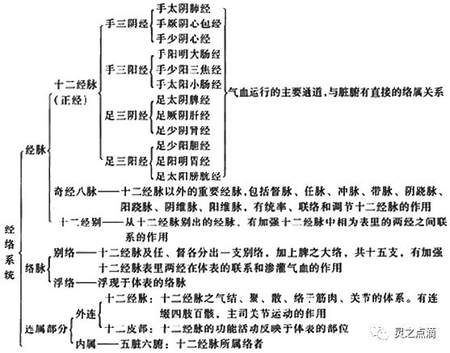

《黄帝内经》对经络系统及其功能的认识主要来自于长期的临床观察，也包含一些推理分析的结果和取类比象的描述。记载这些临床观察的文献近年来已在马王堆帛书、张家山竹简和绵阳木人经络模型等出土文物中逐渐找到。这些早期文献主要描述了经脉系统，并涉及了三种古老的医疗手段：一个是灸法，一个是砭术（即用石头治病的一种医术），另一个就是导引术（一种古老的气功），而经脉是这三种医术施用时借助的途径。

## 二、十二正经

十二经脉，是经络系统的主体，具有表里经脉相合，与相应脏腑络属的主要特征。包括手三阴经（手太阴肺经、手厥阴心包经、手少阴心经）、手三阳经（手阳明大肠经、手少阳三焦经、手太阳小肠经）、足三阳经（足阳明胃经、足少阳胆经、足太阳膀胱经）、足三阴经（足太阴脾经、足厥阴肝经、足少阴肾经），也称为“正经”。

 十二经脉通过手足阴阳表里经的联接而逐经相传，构成了一个周而复始、如环无端的传注系统。气血通过经脉即可内至脏腑，外达肌表，营运全身。其流注次序是：从手太阴肺经开始，依次传至手阳明大肠经，足阳明胃经，足太阴脾经，手少阴心经，手太阳小肠经，足太阳膀胱经，足少阴肾经，手厥阴心包经，手少阳三焦经，足少阳胆经，足厥阴肝经，再回到手太阴肺经（如下表）。其走向和交接规律是：手之三阴经从胸走手，在手指末端交手三阳经；手之三阳经从手走头，在头面部交足三阳经；足之三阳经从头走足，在足趾末端交足三阴经；足之三阴经从足走腹，在胸腹腔交手三阴经。

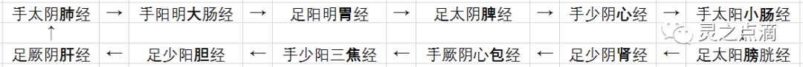
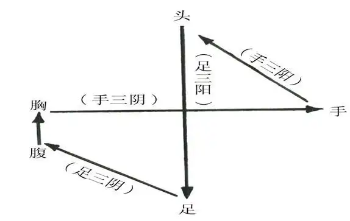

十二经脉流注次序口诀：肺大胃脾心小肠，膀肾包焦胆肝肺。 

任督两脉，原属于奇经八脉，因具有明确穴位，医家将其与十二正经脉合称十四正经脉。任脉主血，为阴脉之海；督脉主气，为阳脉之海。也就是说，任督两脉分别对十二正经脉中的手足六阴经与六阳经脉起着主导作用，当十二正经脉气血充盈，就会流溢于任督两脉；相反的，若任督两脉气机旺盛，同样也会循环作用于十二正经脉，故曰：任督通则百脉皆通。 

### 足少阳胆经

**一、经脉循行** 起自目外眦（瞳子髎），向上到达额角部（颔厌），下行至耳后（风池），沿着颈部行于手少阳经的前面，到肩上交出手少阳经的后面，向下进入缺盆部；耳部的支脉：从耳后进入耳中，出走耳前，到目外眦后方；外眦部的支脉：从目外眦处分出，下走大迎，会合于手少阳经到达目眶下，下行经颊车，由颈部向下会合前脉于缺盆，然后向下进入胸中，通过横膈，联络肝脏，属于胆，沿着胁肋内，出于少腹两侧腹股沟动脉部，经过外阴部毛际，横行入髋关节部（环跳）；缺盆部直行的脉：下行腋部，沿着侧胸部，经过季胁，向下会合前脉于髋关节部，再向下沿着大腿的外侧，出于膝外侧，下行经腓骨前面，直下到达腓骨下段，再下到外踝的前面，沿足背部，进入足第四趾外侧端（足窍阴）；足背部支脉：从足临泣处分出，沿着第一、二跖骨之间，出于大趾端，穿过趾甲，回过来到趾甲后的毫毛部（大敦，属肝经），与足厥阴肝经相接。

**二、主治病候** 本经腧穴主治侧头、目、耳、咽喉病，神志病，热病以及经脉循行部位的其他病证。如口苦，目眩，疟疾，头痛，颔痛，目外眦痛，缺盆部肿痛，腋下肿，胸、胁、股及下肢外侧痛，足外侧痛，足外侧发热等证。

**三、经穴分布** 本经经穴分布在目外眦，颞部，耳后，肩部，胁肋，下肢外侧，膝外侧，外踝的前下方，足第四趾端等部位。起于瞳子髎，止于足窍阴，左右各44穴。

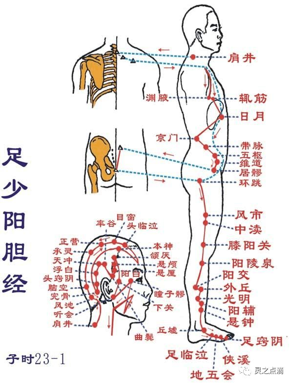

### 足厥阴肝经

**一、经脉循行** 起于足大趾上毫毛部（大敦丫），沿着足跗部向上，经过内踝前一寸处（中封），向上至内踝上八寸处交出于足太阴经的后面，上行膝内侧，沿着股部内侧，进入阴毛中，绕过阴部，上达小腹，挟着胃旁，属于肝脏，联络胆腑，向上通过横膈，分布于胁肋，沿着喉咙的后面，向上进入鼻咽部，连接于“目系” （眼球连系于脑的部位），向上出于前额，与督脉会合于巅顶；“目系”的支脉：下行颊里，环绕唇内；肝部支脉：从肝分出，通过横膈，向上流注于肺，与手太阴肺经相接。

**二、主治病候** 本经腧穴主治肝病，妇科、前阴病以及经脉循行部位的其他病证。如腰痛，胸满，呃逆，遗尿，小便不利，疝气，少腹肿等证。

**三、经穴分布** 本经经穴分布在足背，内踝前，胫骨内侧面，大腿内侧，前阴，胁肋等。起于大敦，止于期门，左右各14穴。

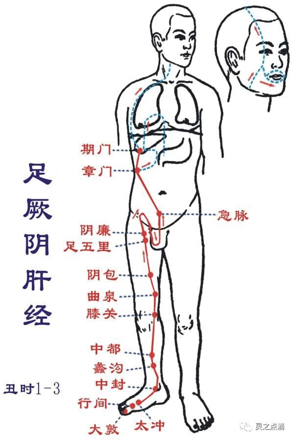

### 手太阴肺经
**一、经脉循行** 起于中焦，向下联络大肠，回绕过来沿着胃的上口，通过横膈，属于肺脏，从“肺系”（肺与喉咙相联系的部位）横行出来（中府），向下沿上臂内侧，行于手少阴经和手厥阴经的前面，下行到肘窝中，沿着前臂内侧前缘，进入寸口，经过鱼际，沿着鱼际的边缘，出拇指内侧端（少商）。手腕后方的支脉：从列缺穴分出，一直走向食指内侧端（商阳），与手阳明大肠经相接。

**二、主治病候** 本经腑穴主治喉、胸、肺病，以及经脉循行部位的其他病证。如咳嗽，气喘，少气不足以息，咳血，伤风，胸部胀满，咽喉肿痛，缺盆部及手臂内侧前缘痛，肩背寒冷、疼痛等证。

**三、经穴分布** 本经经穴分布在胸部的外上方，上肢掌面桡侧和手掌及拇指的桡侧。起于中府，止于少商，左右各11个穴位。 

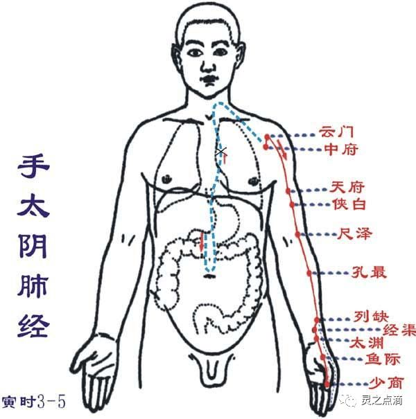

### 手阳明大肠经
**一、经脉循行** 从食指末端起始（商阳），沿食指桡侧缘（二间、三间）出第一、二掌骨间（合谷），进入两筋（拇长伸肌腱和拇短伸肌腱）之间（阳溪），沿前臂桡侧（偏历、温溜、下廉、上廉、手三里），进入肘外侧（曲池、肘髎），经上臂外铡前边（手五里、臂臑），上肩，出肩峰部前边（肩髃、巨骨，会秉风），向上交会颈部（会大椎），下入缺盆（锁骨上窝），散络肺，通过横膈，属于大肠。上行的一支：从锁骨上窝上行颈旁（天鼎、扶突），通过面颊，进入下齿槽，出来挟口旁（会地仓），交会人中部（会水沟）——左边的向右，右边的向左，上夹鼻孔旁（禾髎、迎香、接足阳明胃经）。

**二、主治症候** 本经腧穴主治头面，五官，咽喉病，热病及经脉循行部位的其他病证。如腹痛，肠鸣，泄泻，便秘，痢疾，咽喉肿痛，齿痛，鼻流清涕或出血，本经循行部位疼痛，热肿或寒冷等症。

**三、经穴分布** 手阳明大肠经经穴分布在上肢前外侧面、肩部、锁骨上窝、颈部、面部。起于商阳穴，止于迎香,左右各20穴。

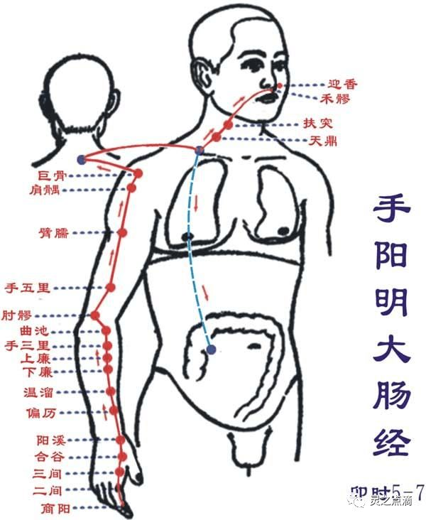

### 足阳明胃经
**一、经脉循行** 起于鼻翼两侧（迎香），上行到鼻根部，与旁侧足太阳经交会，向下沿着鼻的外侧（承泣），进入上齿龈内，回出环绕口唇，向下交会于颏唇沟承浆（任脉）处，再向后沿着口腮后下方，出于下颌大迎处，沿着下颌角颊车，上行耳前，经过上关（足少阳经），沿着发际，到达前额（神庭）；面部支脉：从大迎前下走人迎，沿着喉咙，进入缺盆部，向下通过横膈，属于胃，联络脾脏；缺盆部直行的支脉：经乳头，向下挟脐旁，进入少腹两侧气冲；胃下口部支脉：沿着腹里向下与气冲会合，再由此下行至髀关，直抵伏兔部，下至膝盖，沿着胫骨外侧前线，下经足跗，进入第二足趾外侧端（厉兑）；胫部支脉：从膝下3寸（足三里）处分出，进入足中趾外侧；足跗部支脉：从跗上（冲阳）分出，进入足大趾内侧端（隐白），与足太阴脾经相接。

**二、主治病候** 本经腧穴主治胃肠病、头面、目、鼻、口、齿痛、神志病及经脉循行部位的其他病证。如肠鸣腹胀，水肿，胃痛，呕吐或消谷善饥，口渴，咽喉肿痛，鼻血丑，胸部及膝膑等本经循行部位疼痛，热病，发狂等病证。

**三、经穴分布** 足阳明胃经经穴分布在头面部、颈部部、胸腹部、下肢的前外侧面。起于承泣，止于厉兑，左右各45穴。

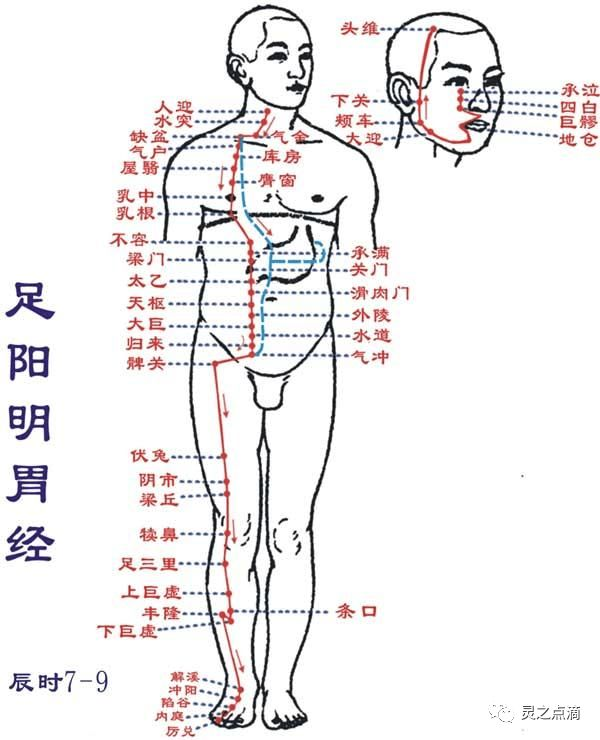

### 足太阴脾经
**一、经脉循行** 起自足大趾末端（隐白），沿着大趾内侧赤白肉际，经过大趾本节后的第一跖趾关节后面，上行至内踝前面，再上腿肚，沿着胫骨后面，交出足厥阴经的前面，经膝股部内侧前缘，进入腹部，属于脾脏，联络胃，通过横膈上行，挟咽部两旁，连系舌根，分散于舌下；胃部支脉：向上通过横膈，流注于心中，与手少阴心经相接。

**二、主治病候** 本经腧穴主治脾胃病，妇科，前阴病及经脉循行部位的其他病证。如胃脘痛，食则呕，嗳气，腹胀便溏，黄疸，身重无力，舌根强痛，下肢内侧肿胀，厥冷等。

**三、经穴分布** 本经经穴分布在足大趾，内踝，下肢内侧，腹胸部第三侧线。起于隐白，止于大包，左右各21穴。

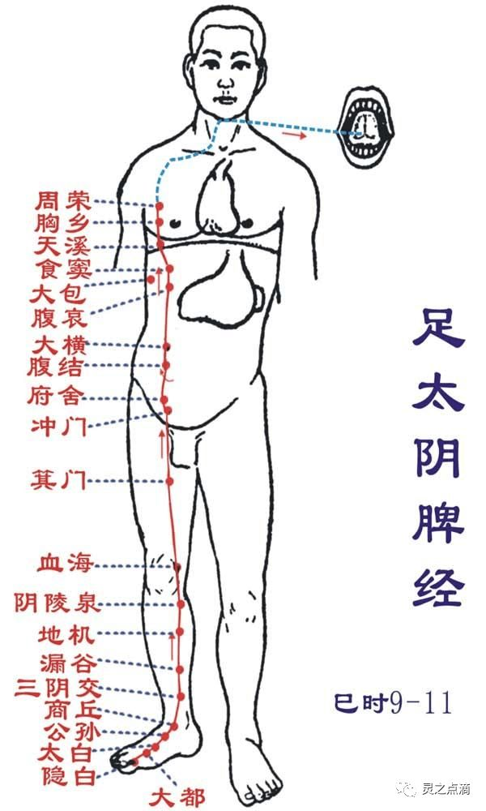

### 手少阴心经
**一、经脉循行** 起于心中，出属“心系”（心与其他脏器相连系的部位），通过横膈，联络小肠；“心系”向上的脉：挟着咽喉上行，连系于“目系”（眼球连系于脑的部位；“心系”直行的脉：上行于肺部，再向下出于腋窝部（极泉），沿着上臂内侧后缘，行于手太阴经和手厥阴经的后面，到达肘窝，沿前臂内侧后缘，至掌后豌豆骨部，进入掌内。沿小指内侧至末端（少冲），与手太阳小肠经相接。

**二、主治病候** 本经腧穴主治心、胸、神志病以及经脉循行部位的其他病证。如心痛，咽干，口渴，目黄，胁痛，上臂内侧痛，手心发热等。

**三、经穴分布** 本经经穴分布在腋下，上肢掌侧面的尺侧缘和小指的桡侧端。起于极泉，止于少冲，左右各9穴。 

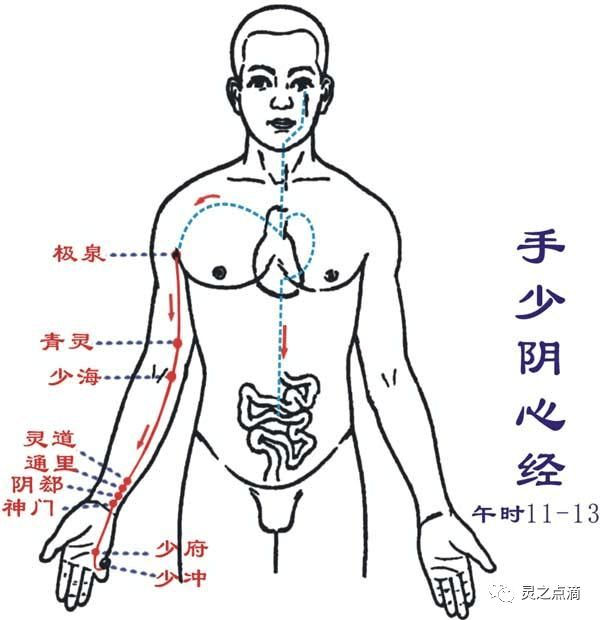

### 手太阳小肠经
**一、经脉循行** 起于于小指外侧端（少泽），沿着手背外侧至腕部，出于尺骨茎突，直上沿着前臂外侧后缘，经尺骨鹰嘴与肱骨内上髁之间，沿上臂外侧后缘，出于肩关节，绕行肩胛部，交会于大椎（督脉），向下进入缺盆部，联络心脏，沿着食管通过横膈，到达胃部，属于小肠；缺盆部支脉：沿着颈部，上达面颊，至目外眦，转入耳中（听宫）；颊部支脉：上行目眶下，抵于鼻旁，至目内眦（睛明），与足太阳膀胱经相接，而又斜行络于颧骨部。

**二、主治病候** 本经腧穴主治头、项、耳、目、咽喉病，热病，神经病以及经脉循行部位的其他病证。如少腹痛，腰脊痛引睾丸，耳聋，目黄，颊肿，咽喉肿痛，肩臂外侧后缘痛等。

**三、经穴分布** 本经经穴分布在指、掌尺侧、上肢背侧面的尺侧缘，肩胛及面部。起于少泽，止于听宫，左右各19穴。

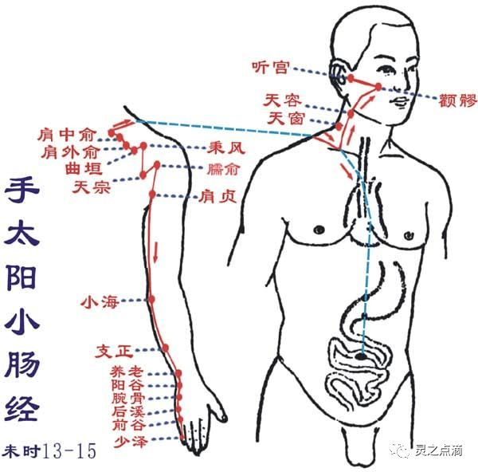

### 足太阳膀胱经
**一、经脉循行** 起于目内眦（睛明），上额交会于巅顶（百会，属督脉）；巅顶部支脉：从头顶到颞颏部；巅顶部直行的脉：从头顶入里联络于脑，回出分开下行项后，沿着肩胛部内侧，挟着脊柱，到达腰部，从脊旁肌肉进入体腔，联络肾脏，属于膀胱；腰部的支脉：向下通过臀部，进入腘窝中；后项的支脉：通过肩胛内缘直下，经过臀部（环跳，属足少阳胆经）下行，沿着大腿后外侧，与腰部下来的支脉会合于腘窝中。从此向下，通过排肠肌，出于外跟的后面，沿着第五跖骨粗隆，至小趾外侧端（至阴），与足少阴经相接。

**二、主治病候** 本经腧穴主治头、项、目、背、腰、下肢部病证以及神志病，背部第一侧线的背俞穴及第二侧线相平的腧穴，主治与其相关的脏腑病证和有关的组织器官病证。如小便不通，遗尿，癫狂，疟疾，目痛，迎风流泪，鼻塞多涕，鼻血丑，头痛，项、背、腰、臀部以及下肢后侧本经循行部位疼痛等证。

**三、经穴分布** 本经经穴分布在眼眶，头，项，背腰部的脊柱两侧，下肢后外侧及小趾末端。起于睛明，止于至阴，左右各67穴。

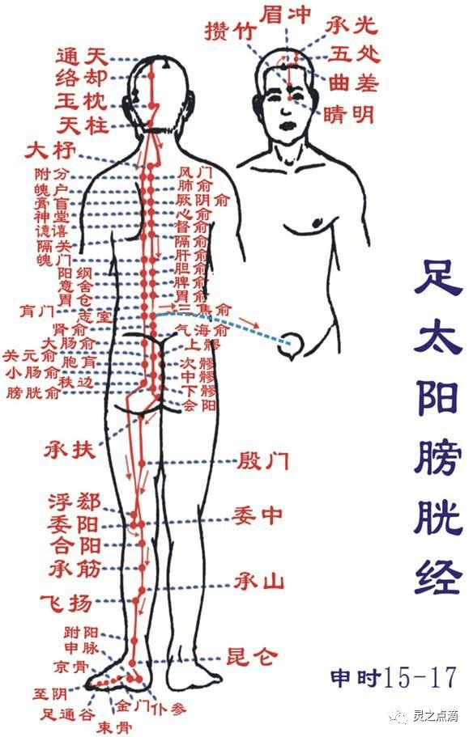

### 足少阴肾经
**一、经脉循行** 起于足小趾之下，斜向足心（涌泉），出于舟骨粗隆下，沿内踝后，进入足跟，再向上行于腿肚内侧，出腘窝的内侧，向上行股内后缘，通向脊柱（长强，属督脉），属于肾脏（腧穴通路：还出于前，向上行腹部前正中线旁开0.5寸，胸部前正中线旁开2寸，终止于锁骨下缘俞府穴），联络膀胱；肾脏部直行的脉：从肾向上通过肝和横膈，进入肺中，沿着喉咙，挟于舌根部；肺部支脉：从肺部出来，联络心脏，流注于胸中，与手厥阴心包经相接。

**二、主治病候** 本经腧穴主治妇科，前阴病，肾、肺、咽喉病及经脉循行部位的其他病证。如：咳血，气喘，舌干，咽喉肿痛，水肿，大便秘结，泄泻，腰痛，脊股内后侧痛，痿弱无力，足心热等病证。

**三、经穴分布** 本经经穴分布在足心，内踝后，跟腱前缘，下肢内侧后缘，腹部，胸部。起于涌泉，止于俞府，左右各27穴。

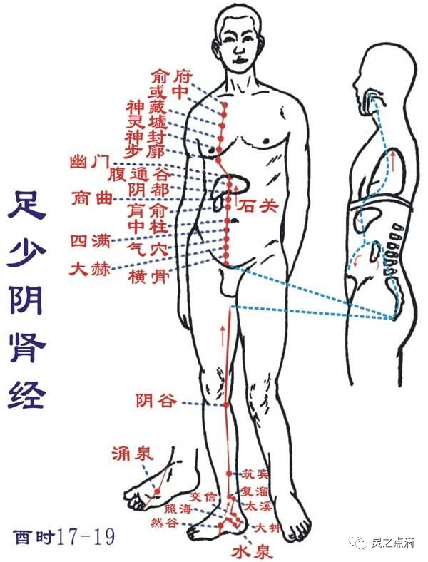

### 手厥阴心包经
**一、经脉循行** 起于胸中，出属心包络，向下通过横膈，从胸至腹依次联络上、中、下三焦；胸部支脉：沿着胸中，出于胁部，至腋下三寸处（天池）上行到腋窝中，沿上臂内侧，行于手太阴和手少阴之间，进入肘窝中，向下行于前臂两筋（掌长肌腱与桡侧腕屈肌腱）的中间，进入掌中，沿着中指到指端（中冲）；掌中支脉：从劳宫分出，沿着无名指到指端（关冲），与手少阳三焦经相接。

**二、主治病候** 本经腧穴主治心、胸、胃、神志病以及经脉循行部位的其他病证。如心痛，胸闷，心悸，心烦，癫狂，腋肿，肘臂挛急等证。

**三、经穴分布** 本经经穴分布在乳旁，上交掌侧面中间及中指末端。起于天池，止于中冲，左右各9穴。 

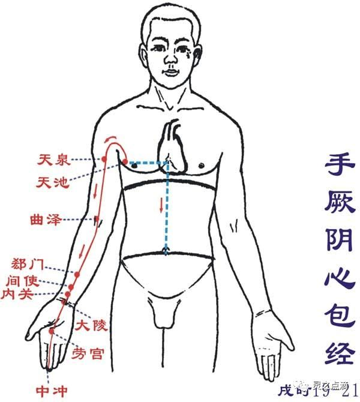

### 手少阳三焦经
**一、经脉循行** 起于无名指末端（关冲）向上出于第四、五掌骨间，沿着腕背，出于前臂外侧桡骨和尺骨之间，向上通过肘尖，沿上臂外侧，上达肩部，交出足少阳经的后面，向前进人缺盆部，分布于胸中，联络心包，向下通过横膈，从胸至腹，属上、中、下三焦；胸中支脉：从胸直上，出于缺盆部，上走项部，沿耳后向上，出于耳部上行额角，再屈而下行至面颊部，到达眶下部；耳部支脉：从耳后进入耳中，出走耳前，与前脉交叉于面颊部，到达目目外眦（丝竹空之下），与足少阳胆经相接。

**二、主治病候** 本经腧穴主治侧头、耳、目、胸胁、咽喉病，热病以及经脉循行部位的其他病证。如腹胀，水肿，遗尿，小便不利，耳鸣，耳聋，咽喉肿痛，目赤肿痛，颊肿，耳后、肩臂肘部外侧疼痛等证。

**三、经穴分布** 本经穴分布在无名指外侧，手背，上肢外侧面中间，肩部，颈部，耳翼后缘，眉毛外端。起于关冲，止于丝竹空，左右各23穴。　

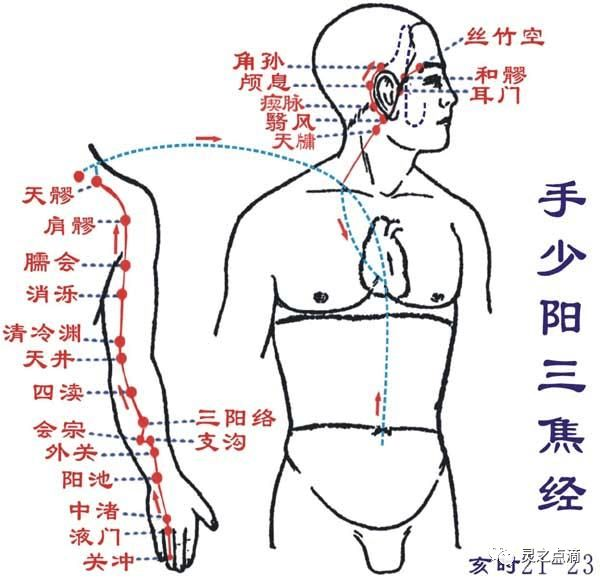 

## 三、奇经八脉

奇经八脉是督脉、任脉、冲脉、带脉、阴跷脉、阳跷脉、阴维脉、阳维脉的总称。

### 任脉
**一、循行部位** 任脉起于胞中，下出于会阴，经阴阜，沿腹部正中线上行，经咽喉部（天突穴），到达下唇内，左右分行，环绕口唇，交会于督脉之龈交穴，再分别通过鼻翼两旁，上至眼眶下（承泣穴），交于足阳明经。分支：由胞中贯脊，向上循行于背部。

**二、生理功能**（1）调节阴经气血，为“阴脉之海”：任脉循行于腹部正中，腹为阴，说明任脉对一身阴经脉气具有总揽、总任的作用。另外，足三阴经在小腹与任脉相交，手三阴经借足三阴经与任脉相通，因此任脉对阴经气血有调节作用，故有“总任诸阴”之说。（2）调节月经，妊养胎儿：任脉起于胞中，具有调节月经，促进女子生殖功能的作用，故有“任主胞胎”之说。 

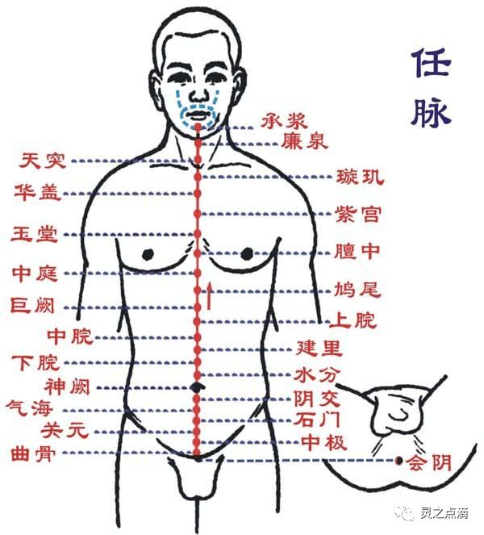

### 督脉
**一、循行部位** 督脉起于小腹内，下出会阴，向后至尾骶部的长强穴（尾闾），沿脊柱上行，经项部至风府穴，进入脑内，属脑，沿头部正中线，上至巅顶的百会穴，经前额下行鼻柱至鼻尖的素寥穴，过人中，至上齿正中的龈交穴。分支：第一支，与冲、任二脉同起于胞中，出于会阴部，在尾骨端与足少阴肾经、足太阳膀胱经的脉气会合，贯脊，属肾。第二支，从小腹直上贯脐，向上贯心，至咽喉与冲、任二脉相会合，到下颌部，环绕口唇，至两目下中央。第三支，与足太阳膀胱经同起子眼内角，上行至前额，于巅顶交会，入络于脑，再别出下项，沿肩胛骨内，脊柱两旁，到达腰中，进入脊柱两侧的肌肉，与肾脏相联络。

**二、生理功能**（1）调节阳经气血，为“阳脉之海”：督脉循身之背，背为阳，说明督脉对全身阳经脉气具有统率、督促的作用。另外，六条阳经都与督脉交会于大椎穴，督脉对阳经有调节作用，故有“总督一身阳经”之说。（2）反映脑、肾及脊髓的功能：督脉属脑，络肾。肾生髓，脑为髓海。督脉与脑、肾、脊髓的关系十分密切。（3）主生殖功能：督脉络肾，与肾气相通，肾主生殖，故督脉与生殖功能有关。 

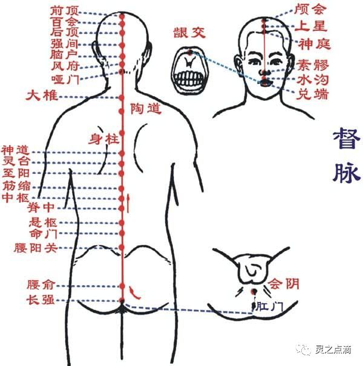

### 冲脉
**一、循行部位** ①起于小腹内，下出于会阴部；②向上行于脊柱内；③其外行者经气冲与足少阴经交会，沿着腹部两侧；④上达咽喉；⑤环绕口唇。

**二、主治病候** 腹部气逆而拘急。

**三、交会腧穴** 会阴，阴交；气冲；横骨，大赫，气穴，四满，中注，肓俞，商曲、石关、阴都、通谷、幽门。

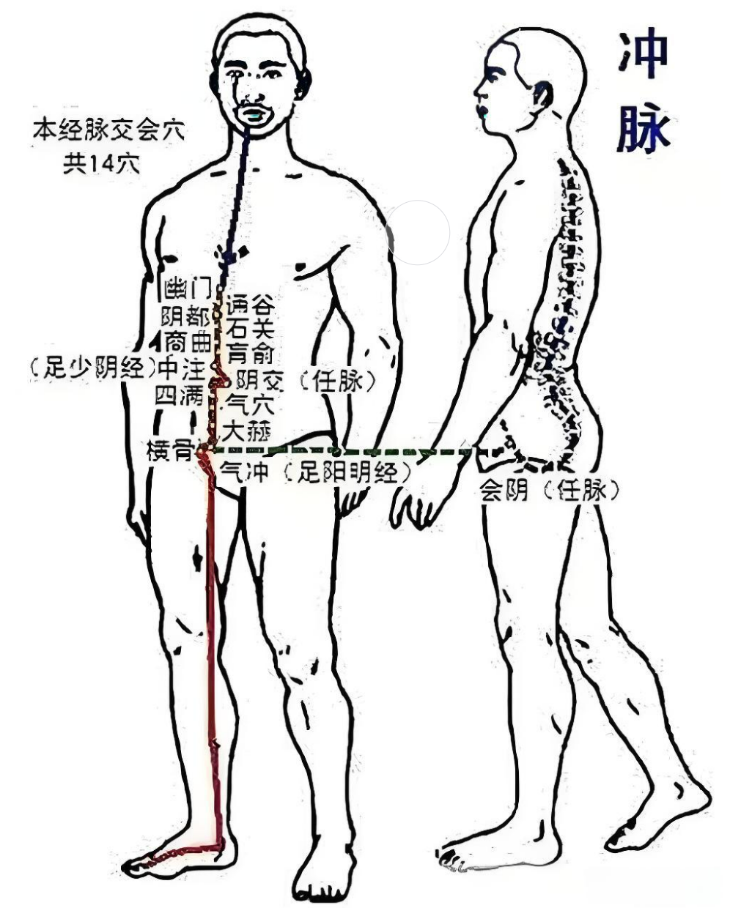

### 带脉
**一、循行部位** ①起于季胁部的下面，斜向下行到带脉、五枢，维道穴，②横行绕身一周。

**二、主治病候** 腹满，腰部觉冷如坐水中。

**三、交会腧穴** 带脉、五枢、维道。

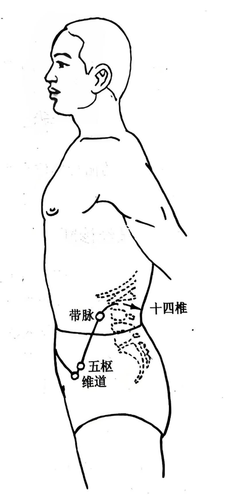

### 阴维脉
**一、循行部位** ①起于小腿内侧，②沿大腿内侧上行到腹部，③与足太阴经相合，④过胸部，⑤与任脉会于颈部。

**二、主治病候** 心痛，忧郁。

**三、交会腧穴** 筑宾；府舍，大横、腹哀；期门；天突、廉泉。

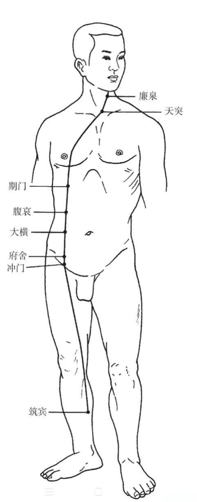

### 阳维脉
**一、循行部位** ①起于足跟外侧，②向上经过外踝，③沿足少阳经上行髋关节部，④经胁肋后侧，⑤从腋后上肩，⑥至前额，⑦再到项后，合于督脉。

**二、主治病候** 恶寒发热，腰疼。

**三、交会腧穴** 金门；阳交；臑俞；天髎；肩井；头维；本神、阳白、头临泣、目窗、正营、承灵、脑空、风池；风府、哑门。

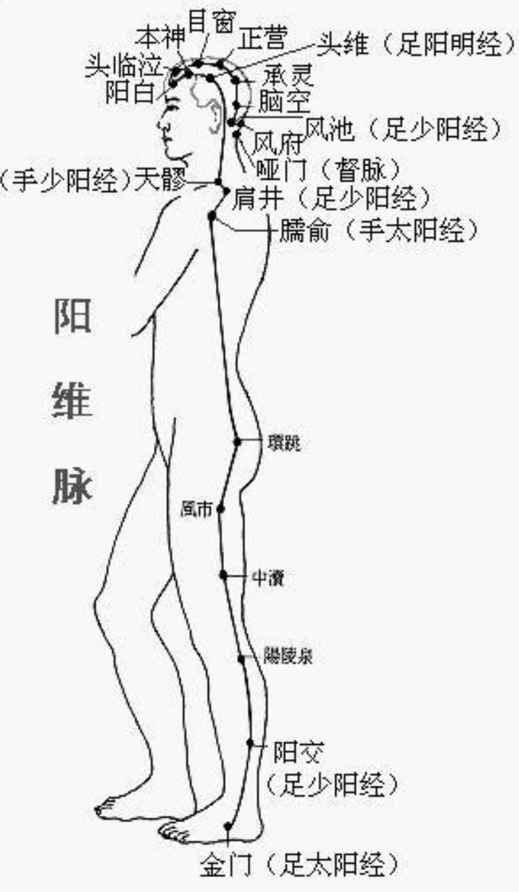

### 阴跷脉
**一、循行部位** ①起于足舟骨的后方②上行内踝的上面，③直上沿大腿内侧，④经过阴部，⑤向上沿胸部内侧，⑥进入锁骨上窝，⑦上经人迎的前面，⑧过颧部，⑨到目内眦，与足太阳经和阳蹻脉相会合。
**二、主治病候** 多眠、癃闭，足内翻等证。

**三、交会腧穴** 照海、交信；睛明。

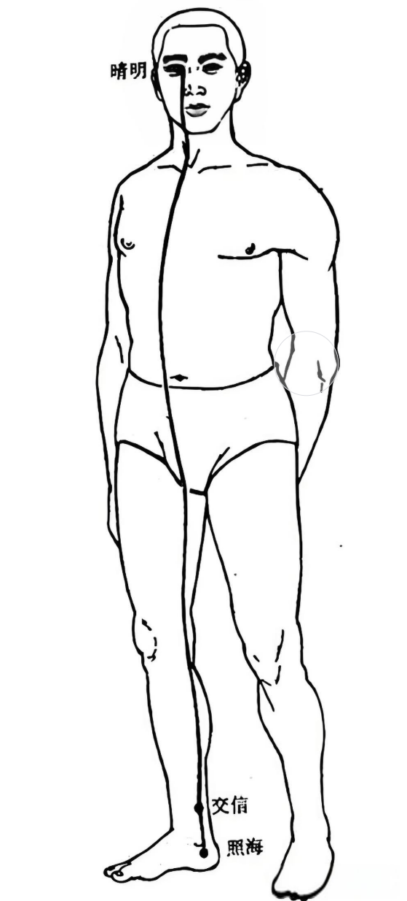

### 阳跷脉
**一、循行部位** ①起于足跟外侧，②经外踝上行腓骨后缘，没股部外侧和胁后上肩，过颈部上挟口角，进入目内眦，与阴蹻脉会合，再沿足太阳经上额，③与足少阳经合于风池。

**二、主治病候** 目痛从内眦始，不眠，足外翻等证。

**三、交会腧穴** 申脉、仆参、跗阳；居髎；臑俞；肩髃、巨骨；天髎；地仓、巨髎、承泣；睛明。

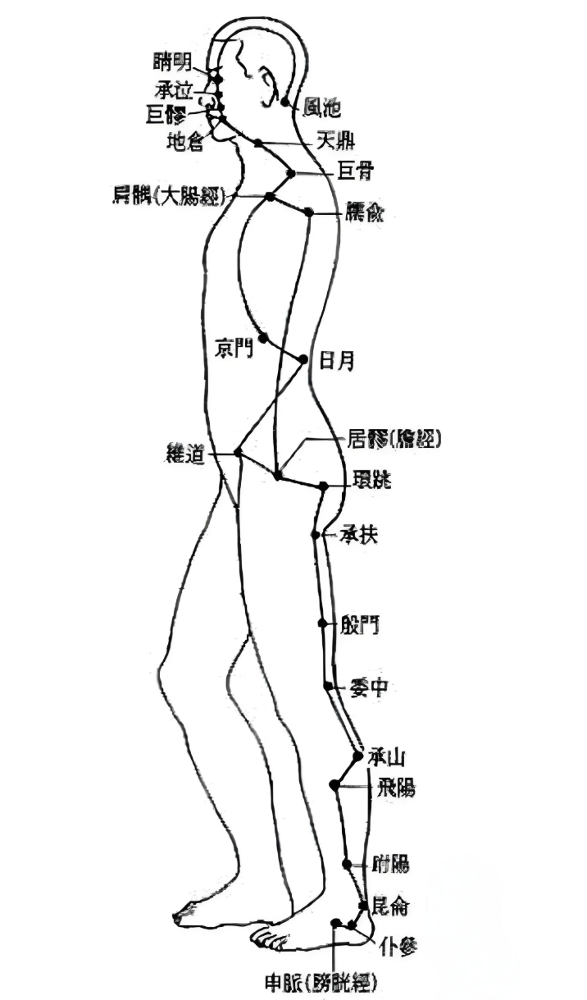

## 四、参考文献
[1] 印会河,张伯讷.中医基础理论[M].上海:上海科学技术出版社,1984.[2] 邱茂良,张善忱.针灸学[M].上海:上海科学技术出版社,1985.