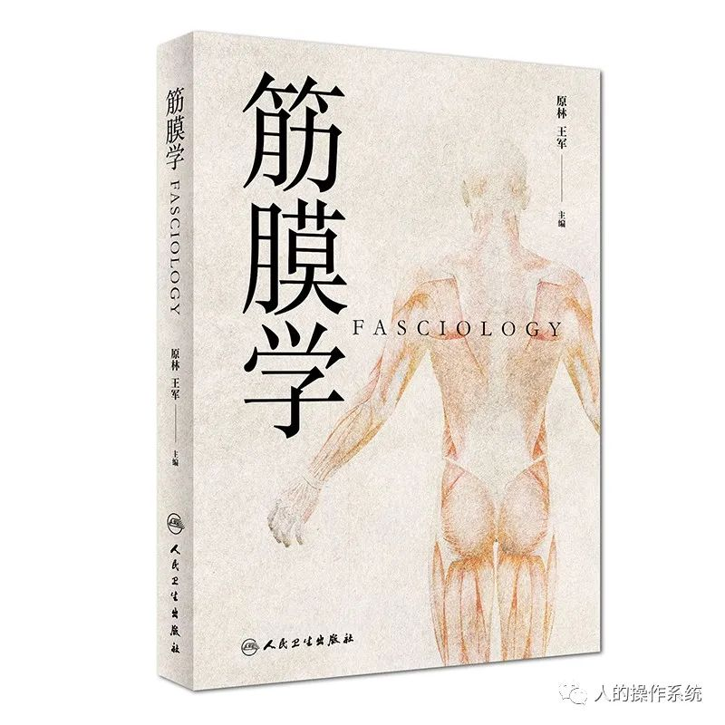

声明：本文是一篇读书笔记，基本上都是从书中摘抄的原话，再加以拼接组合完成，难免有断章取义而以偏概全、望文生义而背离原旨之处，读者见谅。本文仅供参阅，如需更专业信息，请参考原文献。
 
## 一、筋膜学的提出

中医是中华古代科学的重要组成部分，它在理论上和临床实践中对中华文化的发展和人类疾病的防治都起到了至关重要的作用，在亚洲尤其是东亚各国均有传播和发展，在全球的关注度也日益提升。对中医基础理论的研究历来被东亚各国所重视，尤其是对中医各种治疗起到关键指导作用的“经络”的实质的研究，一直都被这些国家（包括中国）作为中医理论研究实现突破的关键性科学问题。

国际学术界对经络进行了长期不倦的研究，很多学者为此投入了毕生的精力。研究形势跌宕起伏，一些人放弃了，更多的人依旧坚持。相信在不少人的心中都有一个共同的信念，那就是支持整个中医理论框架的基石——经络，一定存在于人体之中。新中国成立以后，广大海内外中医工作者做了大量关于经穴实质的研究，提出了大量假说，包括神经说、血管说、神经血管说、神经免疫说、淋巴管说、细胞间隙说、结缔组织说、场能量说等。经过国内外几十年的探索，对于经络与穴位的解剖学、组织学定位基本上达成了共识，经络和穴位与人体结缔组织关系密切。

从发育角度看，人体结缔组织可以分为两大类：（1）未分化的结缔组织（非特异性结缔组织）：包括疏松结缔组织和脂肪组织，两者之间可依脂肪的积累多寡互相转化。这些非特异性结缔组织就是所谓的筋膜。（2）已经分化的结缔组织（特异性结缔组织）：包括硬性固态结缔组织、软性结缔组织和液态结缔组织。硬性固态结缔组织包括骨组织、软骨组织和牙质等；软性固态组织包括韧带、肌腱、腱膜、椎间盘等；液态结缔组织包括血液、淋巴液、组织液、脑脊液、房水、内耳的淋巴和外淋巴等。

近年来发展起来的“数字虚拟人”技术，在人体解剖研究的基础上，借助计算机技术，将人体图象数据、生物物理及其他模型整合成一个统一的数字人模型，并在计算环境中研究人体及其对外界环境的反应。利用数字人，可以方便地将所关注的人体结构提取出来，例如血管、骨骼、脏器等。研究人员在数字人研究的基础上构建了人体全身的筋膜支架网络，并对人体肢体和躯干的肌间隙结缔组织进行了标记和三维重建，再现了与古代文献记载经络走行大致相似的立体串珠状结构。进一步通过计算机三维图像处理软件并结合数学分析方法，在重建的虚拟人体上对这种筋膜重建经线与经典的经线体表走行进行了对比研究。尽管在经脉走行路线上缺乏一个公认的差异范围尺度，但结果仍可以显示人体筋膜三维重建经线的体表分布与中医古代文献记载的经络走行路线基本上是一致的，从而认为人体筋膜重建经线与中医经线在形态上相似，两者之间存在密切的解剖学位置关系。

在经线体表走行对比研究中，也发现了一些问题：虽然在躯干正中线上，筋膜重建经线与任督二脉的体表走行几乎完全重合，可是由于躯干部其他重建筋膜经线的困难性和经典经线本身躯干部走行的复杂性，暂时还无法对其他经线的躯干部走行做对比研究。目前，对头面颈项部的研究也存在同样的问题，而在四肢已经重建出的筋膜经线与十二经脉的走行路线差异则普遍以近端较远端显著，这可能与重建四肢近端经线路线时，计算机三维图像处理过程中的相对不敏感性与不确定性有关。通过筋膜重建经线与经典经线体表走行的对比研究，可以发现人体筋膜与经络两者之间存在密切的解剖学位置关系，并为之提供了形态学上的客观依据，为进一步研究经络提供了更加广阔的前景。

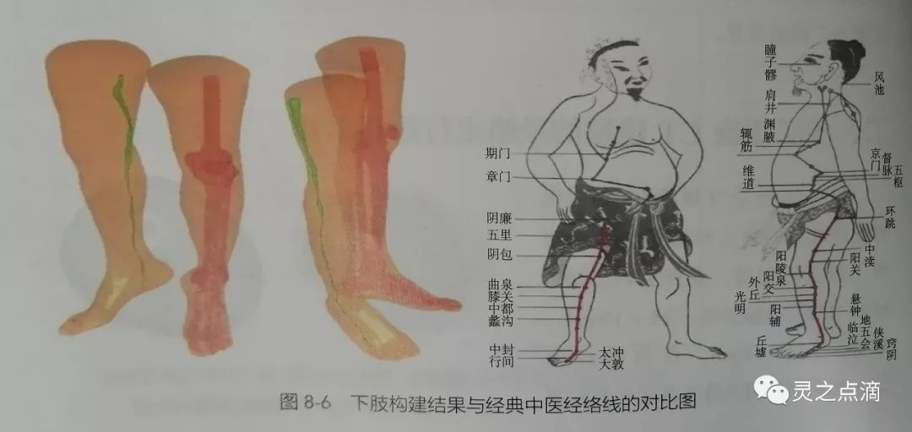

构建出来的筋膜网络只是提示其与经络关系密切，但如果要说它就是经络则还需要一套理论支持。借助现代生物进化的知识理论体系，利用比较解剖学的方法，对整个结缔组织筋膜支架网络进行发育生物学方面的分析，从人向着低等生物回溯，追踪从多细胞生物到三胚层生物再到高等动物的筋膜进化过程和个体胚胎的发育过程：人→草食类动物→爬行类动物→两栖类动物→鱼类→软体鱼→肠腔动物→水母→海胆（胚囊期）。通过从进化的角度观察结缔组织网络的演化路径，发现原来这个结缔组织网络是这个胚囊期的球体内部细胞外基质的演变。从海胆（胚囊期）、水母……一直到人，所有的高等动物可以看做是胚囊这个简单结构的不断变形，其结构越来越复杂，这些结蹄组织细胞有着共同的胚胎发生来源，都来自胚胎时期的间充质细胞，后来经过各种折叠，形成了各种复杂的形状。

此外，国内外研究人员也通过各种相关实验观察到经脉与结缔组织在结构上关系密切。随着各界对人体研究的日益深入，人体筋膜网络与人体经络系统的相关性迅速凸显。纵使不同研究者或研究方法对筋膜的定义有些许出入，但随着对筋膜认识的推进，所有这些研究案例摆在眼前所呈现出来的密切关联性不能不引起人们的重视，中医与西医也出现了融合的趋势，在这种形势下“筋膜学”的理念应运而生。

自然的真相是唯一的，越接近真相，越趋于一致，在寻找真相的过程中，必然殊途同归。这就好像两队人马分别从珠穆朗玛峰的南坡和北坡攀登，虽然走的是不同的路线，但最终到达山顶时看到的景色却是一样的。

## 二、人体结构的双系统理论

筋膜与结缔组织密切相关。结缔组织的起源和进化经历了从多细胞生物的细胞外液→三胚层生物的间充质→高等动物的结缔组织的历程。

在多细胞生物的原生生物，个体结构是由细胞层和细胞外液所组成。外部的细胞层完成了整个生物的全部功能（包括物质摄取、代谢产物的排出、感受外环境的变化及自身的繁殖）；内部的细胞外液起到支撑生物体、参与内部物质的交换以及维持内环境稳定的作用。从整体来看，原生生物可以分为两个系统，即由细胞层所构成的功能系统和细胞外液所构成的支持与储备系统，如海胆胚囊期。
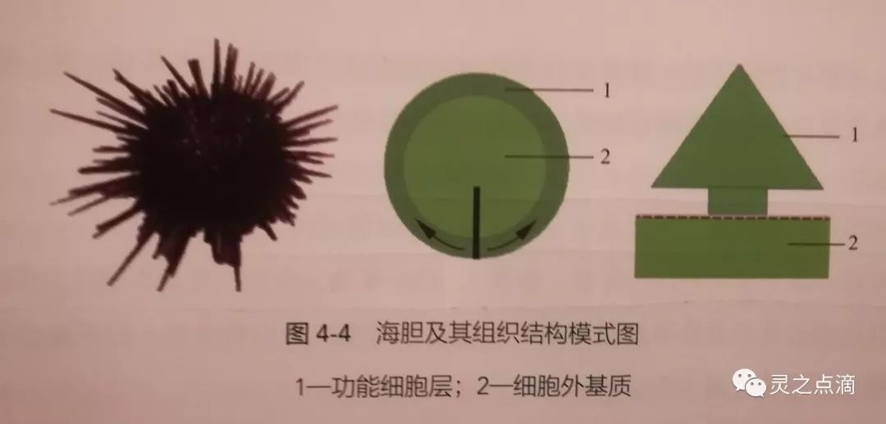

在生物的进化过程中，部分外层细胞向体腔内凹陷，形成内胚层，进一步形成原始消化腔，而未凹陷的细胞形成外胚层。细胞外液充填于两层之间形成了原始的中胚层。如水母的原始中胚层相当于细胞外液的变形，由细胞层分泌的黏多糖蛋白、透明软骨素构成，呈胶冻状，称为中胶层。

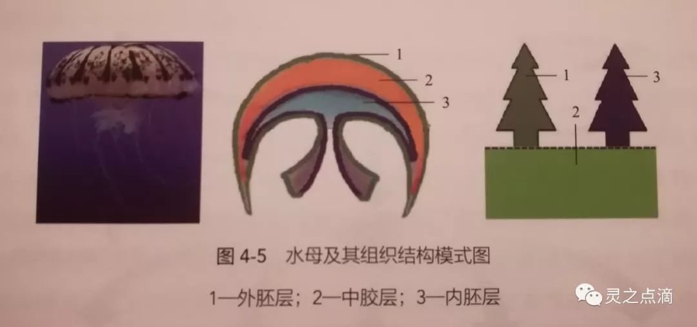

在随后的进化过程中，原始的生物壁层细胞凹陷后形成的消化道，进一步延伸贯通，形成头端的入口和尾端的排泄口，使获取、消化和排泄功能更有效率。部分外层细胞脱落（转移）而进入内、外胚层之间的中胶质，使中胶质内散布了并无特定功能的细胞成分，此时具有细胞成分的中胶层称为间充质，内外胚层之间的空间称为中胚层。这些细胞的存在，为内外胚层功能细胞损伤的修复提供了储备，因而使生物可以维持较长的生命周期，如扁虫类动物。

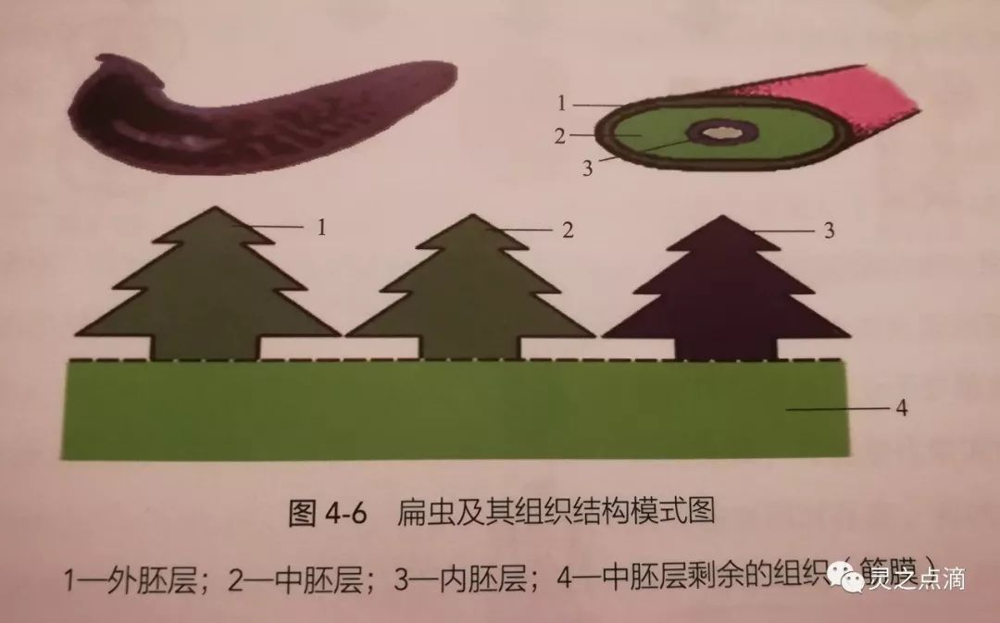

在生物进化的过程中，通过外层细胞的折叠及细胞的迁移，原有的外层细胞形成外胚层、中胚层和内胚层，迁移至胚囊腔的细胞构成了中胚层和外胚层，进一步由这三胚层进化发育成有诸多器官构成的功能系统，具体分化如下：外胚层→表皮及中枢神经系统（包括中枢及周围神经系统）；内胚层→消化系统、呼吸系统、下泌尿及生殖管道的上皮；中胚层→运动系统（骨、关节、肌肉）、循环系统、生殖、泌尿器官及结缔组织。中胚层未分化的非特异性结缔组织（疏松结缔组织与脂肪组织）形成遍布全身的结缔组织支架网络。

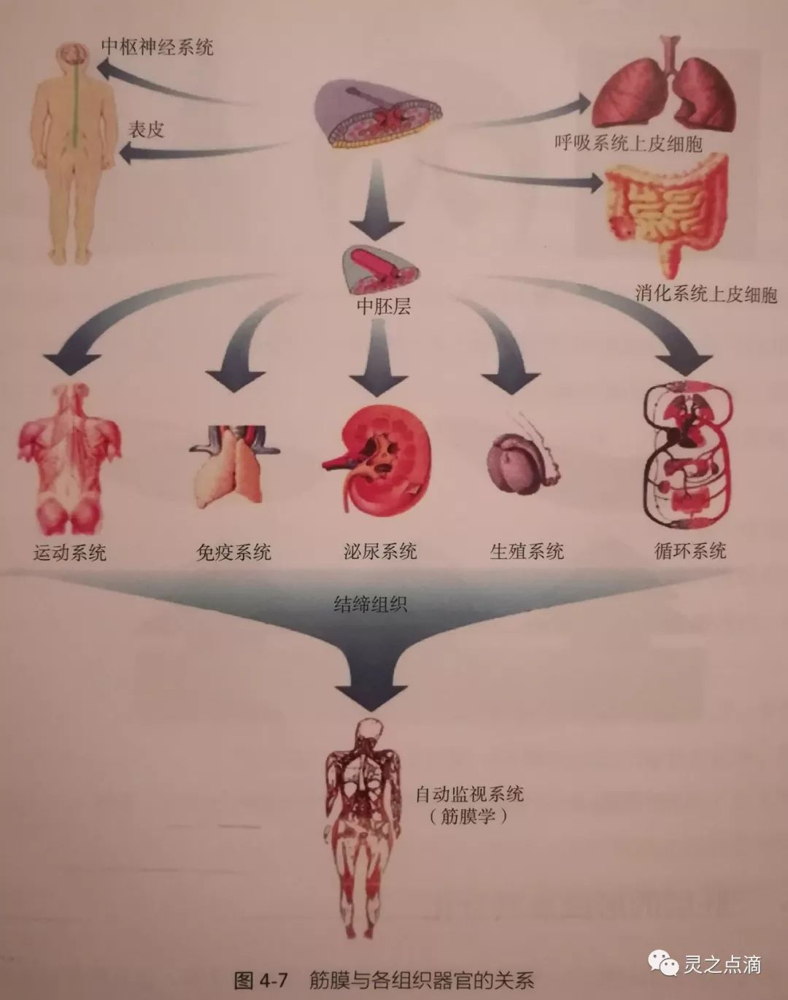

在高等动物中，以三胚层为基础的结构进一步分化完善：外胚层分化为周围与中枢神经和表皮；内胚层分化为消化、呼吸及泌尿系器官下部管道的上皮等；中胚层分化为运动、循环、泌尿系统等诸多器官，剩余的部分形成结缔组织支架网络。

从单胚层生物、二胚层生物、三胚层生物一直分析到高等动物——人的功能结构模式，可以关注到这样一个事实：所有这些生物实际上都是由功能系统及支持储备系统两个大系统构成。有鉴于筋膜学对此内容的研究和发现，人体结构的双系统理论就被提出来了。

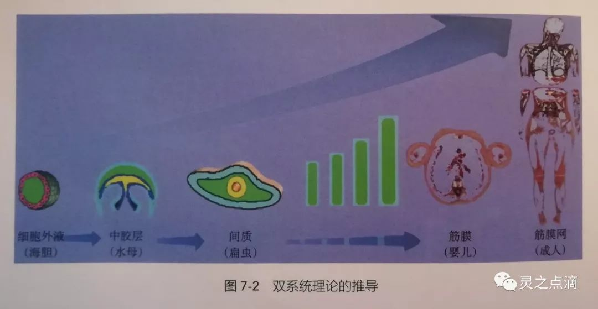

人体结构的双系统理论认为，人体是由两部分系统构成的，一部分是遍布全身的非特异性结缔组织所构成的筋膜支架网络，另一部分是被筋膜支架网络所支持、包绕的已分化的功能细胞构成。从筋膜学说和人体结构的双系统理论来看，筋膜的范围限定于非特异性结缔组织（包括疏松结缔组织和脂肪组织），其余由结缔组织演化的组织统统归为功能系统。

从发生学角度来看，由结缔组织所构成的分布到全身的筋膜支架网络仍然是一个有别于其他功能系统的支持和储备系统。从解剖学角度来看，该支持和储备系统的主要构成分布到全身的筋膜。概括来说：多细胞生物通过细胞外液来维持生物内环境的稳定和修复损伤细胞以调控生物自身代谢；三胚层动物通过间充质分化为各种功能细胞来维持内环境稳定及组织器官修复，以及调控损伤细胞自身的代谢；高等动物则通过筋膜来完成支持、固定、分隔、修复损伤、调控细胞及生物自身代谢的功能。人体非特异性结缔组织支架网络为已分化的组织细胞提供支持和支撑作用，并为这些功能组织细胞的修复、再生提供细胞储备和生存的环境。人体各种功能细胞都是在不断更新修复中维持其结构与功能的稳定，从而保持机体的正常健康状态。这些功能细胞都来自于支持与储备系统中干细胞源源不断的细胞供应和分化。筋膜结缔组织网络就像是土壤，上面长出了各种器官，各种器官又实现了各种功能系统。

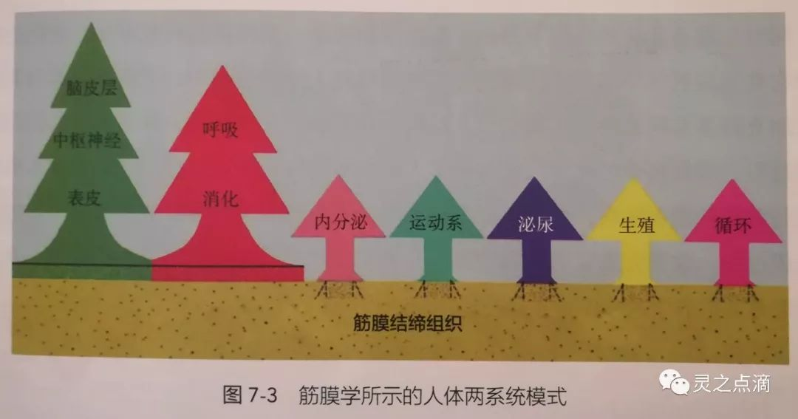

## 三、生物医学的三维视角

达尔文进化论系统地提出了现代生物学的科学框架。在进化论思想的指导下，西方传统医学进入了生物医学的时代，使西方古代医学从经验和知识结构零散的慢车道进入了系统和完整生物科学发展的快车道。进化论从物种对环境的适应出发，对个体生物的结构和功能进行了深入的研究，其后续的研究成果也充分体现了进化论的研究思路是从结构和功能两条轴线上进行研究的。

生物医学主要沿着两条轴线建立了基础医学的学科体系：（1）形态学科，包括解剖学、组织学、细胞学、亚细胞结构研究、蛋白质学和基因学；（2）功能学科，包括生理学、病理生理学及生物信息学等。

从形态结构的视角来看，人体由十大局部构成（头、颈、背、胸、腹、盆、四肢），然后对每个局部再由浅入深地进行研究。从功能系统的角度来看，人体在发育过程中的结构越来越复杂，功能分工也越来越细，细胞种类越来越丰富，细胞和细胞间质构成组织，几种不同的组织相互结合组成器官，诸多器官为完成一种特定的功能形成系统，人体包括四大组织（上皮组织、结缔组织、肌肉组织、神经组织）和九大功能系统（运动系统、消化系统、呼吸系统、泌尿系统、生殖系统、循环系统、免疫系统、神经系统、内分泌系统）。

基于结构和功能的研究模式是二维的研究视角，缺少了另一条重要的轴线——生命的时空轴（寿命轴）。人体细胞的寿命是有限的，以往长期被认为不能再生的重要功能细胞，如中枢神经细胞、心肌细胞等均有一定的生命周期，无非是较长而已，没有任何一种功能细胞的个体可以伴随机体一生。生物在进化的过程中通过结缔组织的不断完善，从细胞外基质到中胶层，再到间充质及非特异性结缔组织，形成了一套完善的生物机体的储备和支持系统。这个系统在传统的神经与免疫系统的参与和调节下，使生物在发育早期形成多潜能细胞，以原生干细胞的形式存储在机体内部，并通过自身横向分化保持一定的数量，这些细胞源源不断地分化成各种功能细胞来补充各功能器官的细胞损失。生物进化的内部不断完善，形成了现有高等动物（包括人类）所具备的由非特异性结缔组织所构成的支持和储备系统。筋膜学的研究对象正是全身的非特异性结缔组织支架网络，在此学说基础上提出的人体结构的双系统理论，正好补充了个体生命的时空轴（寿命轴）。

三个维度研究的特点：①局部解剖学：以人体的结构为轴线，将人体分为十大局部；②系统解剖学：以人体的功能为轴线，将人体分为九大功能系统；③筋膜解剖学：以人体的寿命为轴线，将人体分为两大系统。

筋膜学的研究，从发现人体经络的解剖学物质基础入手，通过对发育生物学和生物进化论的科学推导，提出人体结构的双系统理论，揭示了中医基本理论的科学内涵，从生物医学的角度将现代医学与传统中医有机地结合在同一个框架中，使生物医学的研究从注重结构与功能的二维研究模式，跨入包括结构、功能和生命周期（寿命）在内的三维研究模式，找到了中医理论的生物医学的定位，将中医理论和实践纳入了生物医学的科学范畴，使中医发展进入生物医学的轨道，搭上了现代生物医学发展的快车。

## 四、筋膜的细胞储备作用

人体细胞由三种细胞构成：未分化干细胞、定向干细胞和专能细胞。人体内有274种专能细胞，人体所有生命活动都是由这些专能细胞的协同作用完成的。专能细胞作为一个单个功能体都有一定的生命周期，需要不断地更新。专能细胞的更新是其在破损死亡的同时释放分化因子，促使定向干细胞分化出专能细胞，以补充专能细胞破损造成的缺失。定向干细胞分化专能细胞（纵向分化）的同时，也出现增殖以维持其自身数量的稳定（横向增殖）。定向干细胞在分化、增殖的同时释放诱导因子，诱导未定向干细胞向局部迁移，在定向因子的作用下分化成定向干细胞。

干细胞是一类具有自我复制能力的多潜能细胞，在一定条件下，它可以分化成多种功能细胞。干细胞是维持正常生理活动的重要细胞来源。业界通过多年对干细胞的研究，一个基本的事实是成立的，干细胞是生物个体的细胞源泉，是人体细胞的储备形态，是维系生命的根本细胞。干细胞可随时快速分化为各种功能细胞，属于一线储备细胞。机体内的神经内分泌激素可对细胞的增殖和分化起到快速调节作用，促进或抑制干细胞的增殖分化，如促进增殖的乙酰胆碱，促进分化的去甲肾上腺素，以及各种生长因子。细胞诱导因子，可诱导干细胞向损伤部位集中；细胞分化因子，可诱导干细胞增殖，使局部的干细胞密度增高；细胞定向因子，可诱导干细胞向特定功能细胞分化。

那么，机体本身的“干细胞库”在哪里呢？骨髓组织、脂肪组织、肌肉、肝脏、胰腺等这些可以培养出定向间充质干细胞的组织存在一个共性：本身是结缔组织，或者还有大量的结缔组织。因此，筋膜结缔组织很可能就是机体的“干细胞库”，而筋膜结缔组织对机体的支持储备作用正是通过动员“干细胞库”产生的。从人体支持与储备系统的角度研究人体各器官的功能，则可以看出人体是由支持与储备系统和功能系统所构成的，其中功能系统由多个器官组成，每个器官则是由功能组织和支持储备组织（结缔组织）构成。人体各种功能细胞都是在不断更新修复中维持其结构与功能的稳定，从而保持机体的正常健康状态。这些功能细胞都来自于支持与储备系统中的干细胞源源不断的细胞供应和分化。

筋膜内的细胞主要包括成纤维细胞、巨噬细胞、肥大细胞、浆细胞、脂肪细胞和未分化的间充质细胞。未分化的间充质细胞为筋膜的干细胞，在特定情况下可分裂、分化，形成筋膜组织。

筋膜中，成纤维细胞与干细胞一样，都是来自胚胎间充质细胞，也可以认为它与干细胞一样，是一种储备细胞，与干细胞不同的是它具有合成纤维蛋白原的能力。在整个人体中广泛分布在疏松结缔组织（筋膜）中，与干细胞相比，成纤维细胞相对比较稳定，没有干细胞增殖活跃，在人体的保有数量比干细胞更多，越来越多的实验证据证明成纤维细胞具有干细胞的多向分化能力。根据目前的研究，成纤维细胞可能是干细胞的另外一种存在形式，即细胞的稳定态，其存在的意义是适当减缓干细胞的增殖速度，大量稳定的成纤维细胞的存在，可以源源不断地释放出一些干细胞来维持机体的需要，这样就不至于使干细胞源在快速增殖中迅速老化枯竭，从而使生物的生存时间（寿命）维持得更长。成纤维细胞通常处于静止状态，在机体受到机械性刺激时可快速动员起来并恢复其增殖功能，大量增殖以应对组织损伤的应急修复和再生，属于二线储备细胞。

从当前的研究来看，筋膜中的干细胞和成纤维细胞均属于原生细胞，两者之间有许多共同的特性，比如很强的增值能力和分化能力。一般来讲，干细胞可以分化成各种功能细胞（三个胚层中的各种细胞），成纤维细胞主要分化成中胚层的各种功能细胞（如心肌、骨骼肌、平滑肌、骨、软骨韧带、肌腱和腱膜等）。在干细胞研究过程中的一个发现是，这两种细胞无论是在形态上，还是在分化增殖表现上，都很难分开，期待更多的关于两种细胞之间的互换的研究和实验验证。

脂肪干细胞是近年来从脂肪组织中分离得出的具有分化潜能的干细胞。脂肪组织同样源自胚胎间充质组织，是构成筋膜的绝大部分组织结构实体，是支持与储备系统的组织学载体。从整个胎儿的发育过程中可以看到，在胚胎发育的早期，胎儿的间充质细胞快速分化成各种功能细胞，支持胎儿各部位的器官发育成形，到了胎儿发育的后期，间充质细胞增殖产生的数量已经出现饱和，多余的间充质细胞转化为脂肪细胞并储备在间充质中，形成脂肪组织。脂肪细胞是在长期或慢性刺激的作用下动员起来的细胞，如在慢性消耗、长期影响不良等因素作用下通过脂肪脱颗粒使细胞恢复干细胞的增殖分化能力以应对机体修复和再生能力。

通过对对干细胞、成纤维细胞、脂肪干细胞三种细胞的来源、分布和活性的分析可以看出，在长期的进化过程中，人体形成了一套完整的细胞储备和动员机制。要维持人体功能细胞的数量和功能，必须要有源源不断的新生细胞来补充这些衰老、死亡和崩解的细胞，而筋膜中储备的干细胞通过向各种功能细胞分化，对各种组织器官的细胞进行更新修复，以维持各种器官的正常功能。从支持与储备系统和功能系统的关系分析，人体的衰老过程是一个筋膜中干细胞储备逐渐耗竭的过程。

因此，如何保持筋膜的正常状态，为功能系统不断地提供稳定的修复细胞源并维持向功能细胞的正常分化，是保持人体具有较长生命周期（寿命）的关键。医务工作者可以通过外部介入来调整分化修复过程的不和谐，而传统医学保健的各种实践，如五禽戏、八段锦、易筋经、太极拳、瑜伽和各种导引术等，则为人体的保养提供了丰富的方法。

## 五、筋膜的增殖分化机制

人的神经系统包括中枢神经系统和外周神经系统两部分。中枢神经系统包括大脑和脊髓，外周神经系统进而可以分为躯体神经系统和自主神经系统。躯体神经系统将来自中枢神经系统的信息传递给控制身体运动的骨骼肌，自主神经系统是由将信息传递给腺体及内脏器官的神经组成。自主神经系统，又称为不随意神经系统或植物神经系统，可分为交感神经系统和副交感神经系统两部分。交感和副交感神经系统紧密合作，根据个体所面临的的情况调节及平衡身体的机能。交感神经可引起绝大部分皮肤的动脉收缩（以增加心、肌和脑的血供）、心跳加快、血压升高、括约肌收缩（如有人紧张时想小便）、肠蠕动减弱等，所有这些内脏活动都是为了动员身体的能量储备，以适应应急的需要。副交感神经活动可引起心跳减慢、消化腺分泌增加、肠蠕动增强等，这种作用方式可以认为是为了增加身体的能量储备。

人体筋膜组织主要受自主神经系统和机械牵拉联合调控。人体筋膜组织的神经调控主要通过神经递质的扩散，并与筋膜中活跃的细胞膜上相应的受体结合以激活细胞，主要调控形式为干细胞的分化与增殖。其中，乙酰胆碱刺激干细胞的增殖，去甲肾上腺素促进干细胞的分化。内脏器官旁和器官内的筋膜组织受交感和副交感神经的双重支配，交感神经的二级神经元分泌去甲肾上腺素，刺激干细胞向功能细胞分化，副交感神经的一级、二级神经元分泌乙酰胆碱，刺激筋膜组织中干细胞的增殖。躯体筋膜组织中交感神经二级神经元分泌的去甲肾上腺素促进干细胞的分化，而肢体的机械牵拉促进干细胞的增殖。

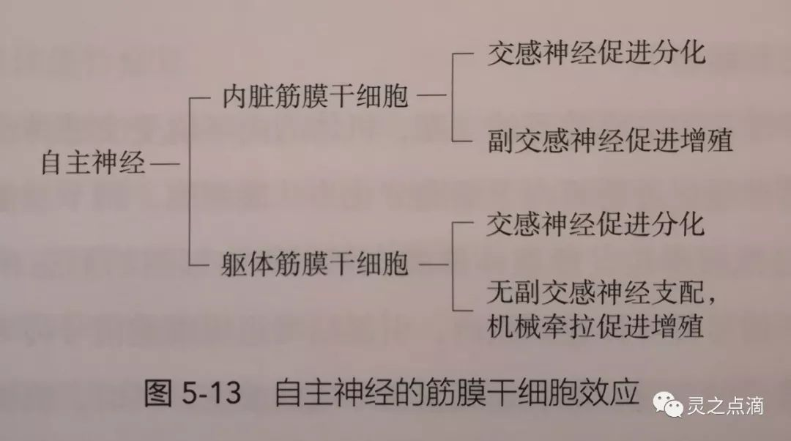

从人体筋膜的角度概括，人体筋膜大体上可以分为内脏筋膜和躯体筋膜两个方面，主要调控形式为筋膜干细胞的增殖和分化。对于内脏筋膜干细胞来说，副交感神经促进其增殖，交感神经促进其分化；对于躯体筋膜干细胞来说，机械牵拉促进其增殖，交感神经促进其分化。

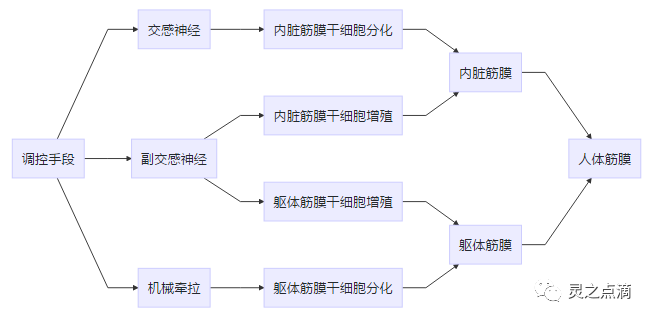

筋膜学将人体分为支持与储备系统、功能系统两大系统。这两个系统之间的相互作用主要由神经和神经内分泌进行调节。各种冲动通过感觉神经经脊髓皮质束到达丘脑，并在换元后向大脑皮质、边缘系统及皮质下结构发出冲动，再由这些结构向丘脑发出冲动，并阻断上行伤害刺激向皮质的传导，向丘脑下部发出冲动并激发下丘脑分泌各种调节激素，调节交感和副交感神经的兴奋性，一方面调控功能组织的活动和代谢，另一方面释放递质并通过神经内分泌的形式扩散到筋膜组织以调控干细胞的增殖和分化，从而促进功能细胞的更新和修复。

## 六、筋膜的生物力学特性

筋膜的核心结构均附着在人体的硬性支架——骨骼上。骨骼本身起源于筋膜。生物体内的筋膜组织在生物进化中得力于成纤维细胞和胶原纤维，通过分化为软骨细胞和钙盐沉积形成骨细胞，最终形成生物个体的硬性支架。骨骼作为整个筋膜网络的硬性支架或者说是旗杆，对筋膜的作用体现在力学方面，通过应力的改变调节筋膜的生理活性。

筋膜是一种纤维性结构，遍布全身，构成了全身连续性的网络支持。这些纤维网状结构以胶原纤维为主，并还有少量弹性纤维和网状纤维。这些纤维形成的网格为细胞附着和均匀分布起到了支撑作用，同时纤维可以将机械牵拉应力传递到其上所附着的细胞，引起细胞的变形和生化反应等。

众多学者认为筋膜是一个三维网状结构并贯穿全身。当肌肉收缩时，结缔组织支架网络被拉伸，同时可以传递张力。筋膜网络作为一个人体张力网，就像一个蜘蛛网一样，拉扯任何一点，感应都会传递到整个蜘蛛网。事实上，筋膜作为一种膜性结构，贯穿了整个身体并扩展维持了基线张力。筋膜具有张力的时候，可以作为一种特殊的本体感受器刺激。当肌肉收缩时，可以传递收缩力到特定的筋膜区域，刺激相应区域的本体感受器。筋膜在本体感受方面具有重要作用，尤其是动力本体感受。

筋膜网络中的生物力学信息，通过“震动”以音速传输。筋膜系统这个纤维网络传递信息的速度比神经系统更快，这可能与通常的认知相反。每个机械力量的微小变动都会被“注意到”并沿着纤维网络中的纤维传播开去。这些纤维如果受到牵拉，则会将牵拉的应力传送到引起形变的关联组织，从而带动所关联的感觉神经末梢，产生酸、麻、胀等感觉。另外，通过特定的牵拉训练，纤维排列的方向会趋向于牵拉应力的方向，而有序排列的纤维要比随意排列的纤维更有力量。

从筋膜学的角度可以认为：经络是全身非特异性结缔组织支架网络，经筋是运动系统的结缔组织支架网络，膜原是内脏的结缔组织支架网络。经筋与膜原是中医学的两个基本范畴，同属于中医学中的形态学概念，具有实际的解剖学基础。经筋概念首见于《灵枢·经筋》，后世医家对经筋的研究多据此发挥。膜原的概念首见于《内经》中《疟论》《岁露论》《举痛论》和《百病始生》等四篇文献。经筋多循行于体表，但还有多条经筋进入体腔；膜原以脏腑膜类组织为重点，但也遍及全身。筋与膜在中医学体系中同属于外联肢骸、内联脏腑的膜性组织，只不过膜比筋软而薄，在软组织中居于深层。谈及经筋与膜原时，论经筋则偏于体表四肢，论膜原则偏重体腔内部，但若从深层次整合，则筋与膜共同组成了筋膜学所指的筋膜支架网络体系。

长期以来，筋膜并没有引起医学界的重视，只是认为筋膜在人体中起到填充、分割和缓冲的作用。与西方主流医学截然不同的是，中国古代医学对人体筋膜（简称为“筋”）自始至终都高度重视，并将对“筋”的认识提高到理论层面——经络。在中国古代医学中，“筋”和“经络”的概念相似，“筋”侧重于应用层面，而“经络”侧重于理论层面。黄敬伟认为“十二经筋图线的实质，是人体经筋系统组织动态活动反作用力的力线遗迹”。薛立功认为“经筋更重要的临床意义在于它是对人体运动力线的深刻总结和描述。这种描述，从生理上概括出参与同项运动的肌肉组的分布规律，在病理发展过程中，又是病痛传变的潜在扩延线”。

从筋膜学说的角度来看，筋膜在人体的不同部位呈现出结构的多样性，从浅入深依次分为：①真皮乳头层疏松结缔组织；②皮下疏松结缔组织（浅筋膜）；③肌肉表面疏松结缔组织（深筋膜）；④肌间隔和肌间隙结缔组织；⑤内脏器官门、被膜和内部间隔结缔组织。这五类筋膜在人体内部构成了完整的支架网络体系。从中医经络学说的角度来看，经络由经脉和络脉组成，经脉又进一步分为十二经脉和奇经八脉，以及附属于十二经脉的十二经别、十二经筋、十二皮部，而络脉又分为十五络脉和孙络、浮络。经络由主要的“干道”（经脉）和“分支”（络脉）组成。关于筋膜与经络的对应关系尚需要更多研究论证，从相关性上来看：十二皮部、孙络、浮络与真皮层致密结缔组织、皮下疏松结缔组织层相对相关；十二经脉、十五络脉与肌间隔疏松结缔组织、神经血管束周围结缔组织相对相关；奇经八脉、十二经别与肌间隔疏松结缔组织、器官门和被膜结缔组织相对相关。

根据筋膜学理论，穴位是在人体筋膜结缔组织组织聚集处，能在刺激过程中产生较强生物学信息（神经、淋巴、交感）的部位。人体筋膜支架网络遍布全身表层并深入组织器官之间，形成间隔、间膜、被膜及各种外模等。因此，从筋膜学的角度，人体刺激部位（穴位）与非穴位之间，只有信息量的区别而没有质的区别。按照中医腧穴理论，腧穴是人体脏腑经络之气血汇注、出入、转输、分流的部位，也是针灸治疗的场所，人体上可分为十四经穴、经外奇穴、阿是穴等，也可以说人体各部位均有穴位存在。

根据筋膜学的研究，结合自主神经在身体的分布，一种对任督二脉的新的理解被提出，认为任脉是内脏筋膜的总称，督脉是躯体和四肢深部筋膜的总称。“任脉主血，为阴脉之海；督脉主气，为阳经之海”，任督二脉涵盖了手三阴、手三阳、足三阴、足三阳这十二正经，分别对十二正经中的阴阳正经起主导作用，故曰“任督二脉通则百脉皆通”。

## 七、中西医治疗理念的差异

根据筋膜学对人体结构的理解，人体是由功能系统和支持与储备系统两个系统构成的。功能系统通过各种功能细胞构成了各个系统的功能器官，完成并维持机体的各种活动；支持与储备系统为这些功能细胞提供支持，并为这些细胞的更新、修复提供细胞储备源，对这些细胞的功能活动进行调控。

由于中西医对人体结构认知视角的差异，直接导致了治疗理念的不同。现代医学与中医对人体生命活动的干预过程各有侧重：现代医学侧重于不同功能细胞的更新、修复和代谢异常所导致的形态和功能障碍，针对这些异常，研究病变的部位和病因，治疗干预多采取外科切除或修复，清楚病原（杀菌、杀虫、抗病毒等）和对症处理。中医多侧重于对支持和储备系统的功能进行干预，改善机体的内部环境，刺激储备系统，以增强机体的自身修复、更新能力，常用的干预方式主要是物理刺激和中药汤剂。

如果将人体的的两大系统比喻为一个花园，筋膜支架网络就相当于花园的土地，筋膜支持和包绕的各种功能细胞相当于生长在土地里的各种花卉。中医通过外治疗法激发机体的各种生理功能来对抗疾病，相当于给土地松土；中医所用的各种汤剂来改变筋膜的环境，相当于给土地进行灌溉和施肥。而西方医学的重点是关注结构和功能系统的变化，即土地上所生长的各种花卉的状况，如发现感染，相当于花卉上长了害虫，那就针对害虫的种类进行杀虫治疗，筛选和使用抗生素。如果发现器质性病变就要进行手术切除，相当于给花卉进行剪枝和修整。

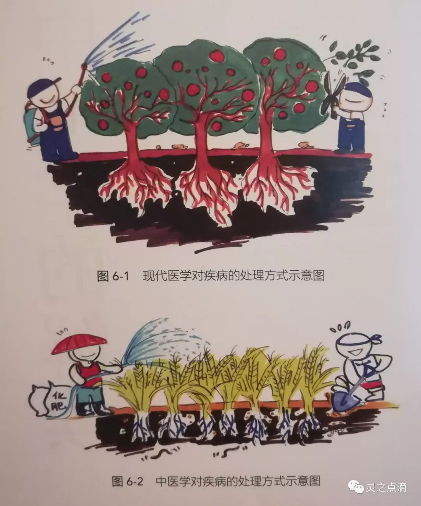

中医在治疗疾病时往往注重机体的整体情况，而对针对病变部位的针对性不强，中医的“异病同治”就反映了这一理念。如通常的中医“活血化瘀”法，既可以用于心血管疾病的治疗，也可以用于骨关节疾病的治疗，甚至肿瘤的治疗，这些疾病在西医看来可以说是互不相干、相距甚远，但在中医看来却都是血瘀所致，或可将中医这种治疗情况比喻为不管这个花园里哪种花卉出现问题，先浇一遍水、施一遍肥再说。这种治疗理念在科技不发达的古代，不能精确有效诊断时，无疑是一种明智的选择，但是在现在看来就有些粗糙，在临床中也反映出中医治病的疗效较慢、针对性不强等弊端。西医的各种疗法同样有其弊端，只注重对病因的对抗治疗，对机体整体的影响关注不够，如抗生素的滥用、肿瘤的扩大化疗、对病变部位的切除等都对机体造成很大的损伤，这些损伤有时是致命的。相信随着筋膜学和人体结构的双系统理论的提出，生物医学从包含结构和功能的二维视角进入到包含结构、功能和生命周期的三维视角，也将使医学研究和对疾病的治疗提升到一个新的更高的水平。

## 八、展望

近年来，国际生命科学界对筋膜网络生物学新机制的研究迅速升温，具有发展成全球性科学研究的趋势。2007年，德国Ulm大学与英国Westminster大学等八家知名科研机构联合创办了有来自28个国家、650人参加的第一届国际筋膜研究大会（The First International Fascia Research Congress，IFRC）；随后于2009年很快就举办了第二届，有40个国家，900人参加。这两次会议以“常规与替代医疗的基础与应用研究”为主题，“筋膜支架网络”或“结缔组织网络”为主要焦点。研究领域涵盖了筋膜解剖学、筋膜生物力学及生理学、筋膜相关的分子生物学和细胞学、筋膜病理学及治疗学、替代疗法的筋膜机制等几乎所有现代医学领域。2012年3月，第三届世界筋膜研究大会在加拿大温哥华召开，参会人数达到1300多人。2015年9月，第四届世界筋膜研究大会在美国华盛顿特区召开，注册人数超过了2000人，涉及60多个国家和地区。2018年11月，第五届世界筋膜研究大会在德国柏林召开。在世界范围内对筋膜的研究热度已经呈现爆发式增长。筋膜学提出至今已经有十多年了，作为一个新学科雏形已逐渐形成。

相信随着筋膜学研究的深入，以及对祖国医学的不断发掘，两者可以相得益彰，或许这也可能为我国广大医学界翘首以待的“中西医结合”开辟一条新的路径。不可讳言，筋膜学只能说还属“初创”阶段，其理论体系有待于进一步完善，其学说未能得到应有的证实，也正为此，期待有更多的学者参与，共同推动筋膜学不断向前。

## 九、参考文献

[1] 原林,王军. 筋膜学[M]. 北京:人民卫生出版社,2018.

