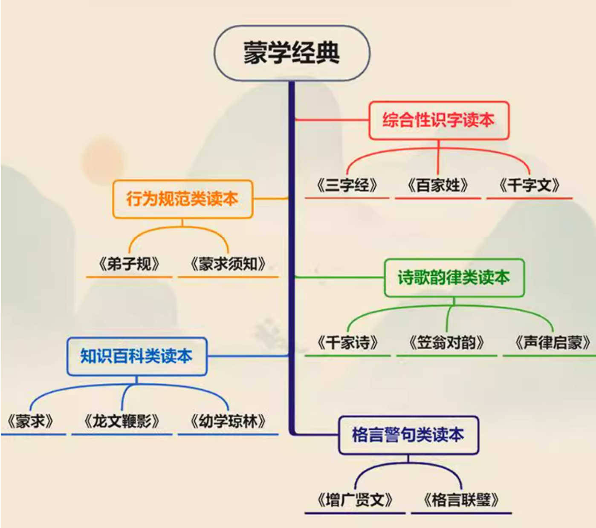

# 文明领域

## 一、文字启蒙
1. 说文解字
      1. 书籍：[万献初讲授,刘会龙撰理.说文解字十二讲.中华书局,2019.](https://book.douban.com/subject/30406194)
      2. 书籍（繁体竖排）：[(东汉)许慎撰,(清)段玉裁注.说文解字注.上海古籍出版社,2010.](https://book.douban.com/subject/1438098)
      3. 视频：[《说文解字(全12讲)》万献初，武汉大学](https://www.bilibili.com/video/BV1jW4y157uh)
2. 音韵学
      1. 书籍：[万献初.音韵学要略:第2版.武汉大学出版社,2012.](https://book.douban.com/subject/19976100)
      2. 视频：[《音韵学(全92讲)》万献初，武汉大学.](https://www.bilibili.com/video/BV1v3411P7Mn)
3. 训诂学
      1. 书籍：[郭在贻.训诂学(修订本).中华书局,2019.](https://book.douban.com/subject/33375680/)
      2. 书籍：[王宁.训诂学原理:增补本.中华书局,2023.](https://book.douban.com/subject/36488308/)
      3. 视频：[卢烈红.《训诂学》，武汉大学，国家精品课.](https://www.bilibili.com/video/BV1vb4y1a78o)

## 二、蒙学经典
1. [中华书局.蒙学经典:全本全注全译大字本(全16册).中华书局,2023.](https://book.douban.com/subject/36621650) 丛书包括：《三字经》《百家姓》《千字文》《弟子规》《蒙求须知》5种合为1册、《千家诗（共1册）》《笠翁对韵（上下册）》《声律启蒙（上下册）》《蒙求（1册）》《龙文鞭影（上下册）》《幼学琼林（共4册）》《格言联璧（上下册）》《增广贤文（1册）》，共13种合16册。
2. [刘弘毅.刘宏毅博士《三字经》讲记.海南出版社,2007.](https://book.douban.com/subject/2171746)
3. [刘弘毅.刘宏毅博士《千字文》讲记.海南出版社,2007.](https://book.douban.com/subject/2171746)
4. [万献初,郭帅华.千字文探源.中华书局,2021.](https://book.douban.com/subject/35500810/)

## 三、诸子百家
1. [中华书局. 新编诸子集成(全40种合60册). 中华书局,2018.](https://book.douban.com/series/662)　均为繁体竖排。
      
            （一）儒家类14种23册
            [01]《论语集释（全4册）》.程树德等撰;程俊英,蒋见元点校,1990.
            [02]《孟子正义（全2册）》.(清)焦循撰;沈文倬点校,1987.
            [03]《四书章句集注》.(宋)朱熹撰;钟哲点校,1983.
            [04]《荀子集解（全2册）》.(清)王先谦撰;沈啸寰,王星贤点校,1988.
            [05]《新语校注》.(汉)陆贾撰;王利器校注,1986.
            [06]《新书校注》.(汉)贾谊撰;阎振益,钟夏校注,2000.
            [07]《春秋繁露义证》.(清)苏舆撰;钟哲点校,1992.
            [08]《盐铁论校注（全2册）》.王利器撰,1992.
            [09]《法言义疏（全2册）》.汪荣宝撰;陈仲夫点校,1987.
            [10]《太玄集注》.(宋)司马光撰;刘韶军点校,1998.
            [11]《白虎通疏证（全2册）》.(清)陈立撰;吴则虞点校,1994.
            [12]《潜夫论笺校正》.(汉)王符撰;(清)汪继培笺,彭铎校正,1985.
            [13]《颜氏家训集解（增补本）（全2册）》.王利器撰,1993.
            [14]《刘子校释》.(北齐)刘昼撰;傅亚庶校释,1988.
            （二）墨家类4种6册
            [15]《墨子閒诂（全2册）》.(清)孙诒让撰;孙以楷点校,1986;孙启治点校,2001.
            [16]《墨子校注（全2册）》.吴毓江撰;孙启治点校,1993.
            [17]《墨辩发微》.谭戒甫撰,1964.
            [18]《墨子城守各篇简注》.岑仲勉撰,1958.
            （三）道家类9种9册
            [19]《老子道德经注校释》.(魏)王弼撰;楼宇烈校释,2008.
            [20]《老子校释》.朱谦之撰,1963.
            [21]《帛书老子校注》.高明撰,1996.
            [22]《庄子集释（全2册）》.(清)郭庆藩撰;王孝鱼点校,1961.
            [23/24]《庄子集解/庄子集解内篇补正》.(清)王先谦撰;刘武撰;沈啸寰点校,1987.
            [25]《列子集释》.杨伯峻撰,1979.
            [26]《抱朴子内篇校释（增订本）》.王明撰,1980.
            [27]《文子疏义》.王利器撰,2000.
            （四）法家类4种7册
            [28]《管子校注（全3册）》.黎翔凤撰;梁运华整理,2004.
            [29]《管子轻重篇新诠（全2册）》.马非百撰,1979.
            [30]《商君书锥指》.蒋礼鸿撰,1986.
            [31]《韩非子集解》.(清)王先慎撰;钟哲点校,1998.
            （五）名家类2种1册
            [32/33]《公孙龙子悬解/公孙龙子形名发微》.王琯撰,1992.谭戒甫撰,1963．
            （六）兵家类2种2册
            [34]《十一家注孙子校理》.(春秋)孙武;(三国)曹操等撰;杨丙安校理,1999.
            [35]《孙膑兵法校理》.张震泽撰,1984.
            （七）杂家类5种12册
            [36]《吕氏春秋集释（全2册）》.许维遹撰;梁运华整理,2009.
            [37]《淮南鸿烈集解（全2册）》.刘文典撰;冯逸,乔华点校,1989.
            [38]《淮南子集释（全3册）》.何宁撰,1998.
            [39]《论衡校释（附刘盼遂集解）（全3册）》.黄晖,刘盼遂撰,1990.
            [40]《抱朴子外篇校笺（全2册）》.杨明照撰,1991(上),1997(下).

2. [中华书局. 新編諸子集成續編.中华书局,2022.](https://book.douban.com/series/1870)　均为繁体竖排。
   
            [01]《荀子简释》梁启雄著.中华书局,1983-01.
            [02]《鬼谷子集校集注》许富宏撰.中华书局,2008-12-17.
            [03]《韩子浅解》梁启雄著.中华书局,2009-07.
            [04]《新辑本桓谭新论》[汉]桓谭撰;朱谦之校辑.中华书局,2009-09-25.
            [05]《风俗通义校注(上下册)》[汉]应劭撰;王利器校注.中华书局,2010-05-24.
            [06]《论衡校读笺识》马宗霍著.中华书局,2010-06-12.
            [07]《鬻子校理》钟肇鹏撰.中华书局,2010-08-18.
            [08]《孔丛子校释》傅亚庶撰.中华书局,2011-07-22.
            [09]《政论校注／昌言校注》[汉]崔寔，[汉]仲长统撰，孙启治校注.中华书局,2012-06-06.
            [10]《申鉴注校补》[汉]荀悦撰;[明]黄省曾注;孙启治校补.中华书局,2012-10-16.
            [11]《四民月令校注》[汉]崔寔撰;石声汉校注.中华书局,2013-06-07.
            [12]《中说校注》张沛撰.中华书局,2013-08-16.
            [13]《慎子集校集注》许富宏撰.中华书局,2013-10-14.
            [14]《意林校释（上下册）》王天海,王韧撰.中华书局,2014-03-21.
            [15]《鹖冠子校注》黄怀信撰.中华书局,2014-04-01.
            [16]《中论解诂》[魏（三国）]徐干撰;孙启治解诂.中华书局,2014-04-23.
            [17]《晏子春秋校注》张纯一撰;梁运华点校.中华书局,2014-06-20.
            [18]《太玄校释》. [汉]扬雄撰,郑万耕校释.中华书局,2015-03-11.
            [19]《庄子补正（上下册）》刘文典撰；赵锋,诸伟奇点校. 中华书局,2015-03-28.
            [20]《李卫公问对校注》吴如嵩,王显臣校注.中华书局,2016.08.
            [21]《新序校释（上中下册）》[西汉]刘向撰;石光瑛校释;陈新整理.中华书局,2017-08.
            [22]《长短经》[唐]赵蕤撰;梁运华校注.中华书局,2017-11.
            [23]《司马法集释》王震撰.中华书局,2018-01-01.
            [24]《曾子辑校》王永辉,高尚举辑校.中华书局,2018-02-06.
            [25]《山海经笺疏》[清]郝懿行撰;栾保群点校.中华书局,2019-10-25.
            [26]《山海经广注》[清]吴任臣撰;栾保群点校.中华书局,2020-06-17.
            [27]《西京杂记校注》[晋]葛洪撰；周天游校注.中华书局,2020-11-02.
            [28]《孔子家语校注》高尚举校注. 中华书局,2021-09-07.
            [29]《吴子集释》陈曦集释.中华书局,2021-10-12.
            （截至2021年底，共29种，仍在增加）

## 四、考古与历史
1. 科普纪录片
      1. 纪录片：[宇宙与人.北京科学教育电影制片厂,2000.](https://www.bilibili.com/video/BV1Ye411x719)
      2. 纪录片：[走出摇篮-人类演化史(全3集)](https://www.bilibili.com/video/BV12E411x7yh/)
2. 世界历史
      1. 书籍：[(美)大卫·克里斯蒂安,辛西娅·斯托克斯·布朗,克雷格·本杰明.大历史:虚无与万物之间.北京联合出版公司,2016.](https://book.douban.com/subject/26827546/)
      2. 书籍：[戴尔·布朗.失落的文明(全24册).华夏出版社/广西人民出版社,2002.](https://book.douban.com/subject/2085288/)
      3. 书籍：[(美)斯塔夫里阿诺斯.全球通史:从史前史到21世纪(上下册).北京大学出版社,2012.](https://book.douban.com/subject/10583099/)
3. 中国历史
      1. 书籍：[吕思勉.中国通史.上海古籍出版社,2009.](https://book.douban.com/subject/3707886/)
      2. 书籍（繁體豎排）：[錢穆.國史大綱（上下）．商务印书馆,2013.](https://book.douban.com/subject/1046492/)
      3. 书籍：[刘莉,陈星灿,陈洪波.中国考古学:旧石器时代晚期到早期青铜时代.三联书店,2017.](https://book.douban.com/subject/27149515/)
      4. 书籍：[李硕.翦商:殷周之变与华夏新生.广西师范大学出版社,2022.](https://book.douban.com/subject/36096304/)
      5. 书籍：[丁一平.回望西周.线装书局,2017.](https://book.douban.com/subject/27080615/)
      6. 书籍：[丁一平.鉴往春秋.中国文史出版社,2014.](https://book.douban.com/subject/30361020/)
      7. 书籍：[(明)冯梦龙著,(清)蔡元放改编.东周列国志.中华书局,2009.](https://book.douban.com/subject/3409620/)
      8. 书籍：[蔡东藩.蔡东藩历朝通俗演义(全21册).中华书局,2015.](https://book.douban.com/subject/26629172/)
      9. 书籍：[中华书局编辑部编著.二十四史:简体横排本(全63册).中华书局,2000.](https://book.douban.com/subject/1012929/)
      10. 书籍：[(清)赵尔巽等撰.清史稿:简体字本(全12册).中华书局,2020.](https://book.douban.com/subject/35128908/)
      11. 书籍（繁体竖排）：[司马迁等.点校本二十四史(全241册).中华书局,2011.](https://book.douban.com/subject/6731120/)

## 五、镇楼三部经典
1. 中西印哲学概论
      1. 书籍：[冯友兰.中国哲学史.华东师范大学出版社,2011.](https://book.douban.com/subject/6780545/)
      2. 书籍：[赵敦华.西方哲学简史:修订版.北京大学出版社,2012.](https://book.douban.com/subject/11510819/)
      3. 书籍：[赵敦华.现代西方哲学新编:第二版.北京大学出版社,2014.](https://book.douban.com/subject/25904483/)
      4. 书籍：[姚卫群.印度宗教哲学概论.北京大学出版社,2006.](https://book.douban.com/subject/1896545/)
2. 《易经》
      1. 书籍：[谭晓春,李殿忠.画说周易.中国工人出版社,1991.](https://book.douban.com/subject/5960777)
      2. 书籍：[万献初.周易讲辞.中华书局,2023.](https://book.douban.com/subject/36608384)
      3. 书籍（繁体横排）：[黄寿祺,张善文.周易译注:最新增订版.中华书局,2016.](https://book.douban.com/subject/26896209)
      4. 视频：[万献初.《解字讲〈周易〉》B站视频](https://www.bilibili.com/cheese/play/ss27186)
3. 《黄帝内经》
      1. 书籍：[原林,王军著.筋膜学.人民卫生出版社,2018.](https://book.douban.com/subject/30775133/)
      2. 书籍： [(美)托马斯·W.迈尔斯著,关玲译.解剖列车：手法与运动治疗的肌筋膜经线(第4版). 北京科学技术出版社,2022.](https://book.douban.com/subject/36157369/)
      3. 书籍：[郭霭春.黄帝内经素问校注语译(全2册).贵州教育出版社,2010.](https://book.douban.com/subject/5339799/)
      4. 书籍：[郭霭春.黄帝内经灵枢校注语译(全2册).贵州教育出版社,2010.](https://book.douban.com/subject/5339798/)
      5. 书籍：[全国高等中医药教材编审委员会.高等中医院校教材:第五版(全32种).上海科学技术出版社,2013.](https://book.douban.com/series/7625)　本套教材计有医古文、中国医学史、中医基础理论、中医诊断学、中药学、方剂学、内经讲义、伤寒论讲义、金匮要略讲义、温病学、中医各家学说、中医内科学、中医外科学、中医儿科学、中医妇科学、中医眼科学、中医耳鼻喉科学、中医伤科学、针灸学、腧穴学、刺灸学、针灸学、针灸医籍选、各家针灸学说、推拿学、药用植物学、中药鉴定学、中药炮制学、中药药剂学、中药化学、中药药理学等三十二门。
4. 《佛经》
      1. 书籍（繁体横排）：[(宋)天竺三藏求那跋陀罗译;王建伟,金晖校释.《杂阿含经》校释.华东师范大学出版社,2014.](https://book.douban.com/subject/24872437/)
      2. 书籍：[恒强,梁踌继译.阿含经校注(全9册).线装书局,2012.](https://book.douban.com/subject/20432687/)
      3. 书籍：[赖永海主编.佛教十三经.中华书局,2010.](https://book.douban.com/subject/20283405/)
      4. 书籍：[陈士强著.大藏经总目提要:文史藏(全2册).上海古籍出版社,2020.](https://book.douban.com/subject/3124593/)
      5. 书籍：[陈士强著.大藏经总目提要:经藏(全3册).上海古籍出版社,2020.](https://book.douban.com/subject/2307281/)
      6. 书籍：[陈士强著.大藏经总目提要:律藏(全2册).上海古籍出版社,2020.](https://book.douban.com/subject/26418746/)
      7. 书籍：[陈士强著.大藏经总目提要:论藏(全3册).上海古籍出版社,2020.](https://book.douban.com/subject/35252040/)
      8. 网站：电子佛典（CBETA)：[https://cbetaonline.cn](https://cbetaonline.cn)