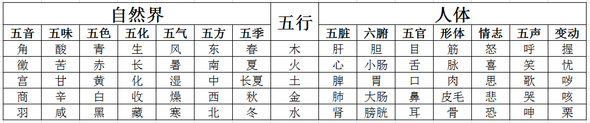

五行学说，是以木、火、土、金、水五行作为结构元素，以生克乘侮为运行原理，用于揭示事物运行系统、诊断系统状态以及制定应对策略的一种系统理论，是世界观与方法论的统一体。

## 一、五行的特性

五行，即是木、火、土、金、水五种物质的运动。我国古代人民在长期的生活和生产实践中，认识到木、火、土、金、水是不可缺少的最基本物质，故五行最初称作“五材”。如《左传》说：“天生五材，民并用之，废一不可”；《尚书》说：“水火者，百姓之所饮食也；金木者，百姓之所兴作也；土者，万物之所资生，是为人用”。 

五行学说，是在“五材”说的基础上，进一步引申为世界上的一切事物，都是由木、火、土、金、水五种基本属性之间的运动变化而生成的。如《国语·郑语》说：“故先王以土与金、木、水、火杂，以成百物”。同时，还以五行之间的生、克关系来阐释事物之间的相互联系，认为任何事物都不是孤立的、静止的，而是在不断的相生、相克的运动之中维持着协调平衡。 

五行的特性，是古人在长期的生活和生产实践中，对木、火、土、金、水五种物质的朴素认识基础上，进行抽象而逐渐形成的理论概念，用以分析各种事物的五行属性和研究事物之间相互联系的基本法则。因此，五行的特性，虽然来自木、火、土、金、水，但实际上已超越了木、火、土、金、水具体物质的本身，而具有更广泛的涵义。 

**木的特性**：古人称“木曰曲直”。“曲直”，实际上是指树木的生长姿态，都是枝干曲直，向上向外周舒展。因而引申为具有生长、生发、条达舒畅等作用或性质的事物，均归属于木。 

**火的特性**：古人称“火曰炎上”。“炎上”，是指火具有温热、上升的特性。因而引申为具有温热、升腾作用的事物，均归属于火。 

**土的特性**：古人称“土爰稼穑”。“稼穑”，是指土有播种和收获农作物的作用。因而引申为具有生化、承载、受纳作用的事物，均归属于土。故有“土载四行”、“万物土中生，万物土中灭”和“土为万物之母”之说。 

**金的特性**：古人称“金曰从革”。“从革”，是指“变革”的意思。引申为具有清洁、肃降、收敛等作用的事物，均归属于金。 

**水的特性**：古人称“水曰润下”。“润下”，是指水具有滋润和向下的特性。引申为具有寒凉、滋润、向下运动的事物，均归属于水。 

## 二、五行与事物的对应法则

五行学说是以五行的特性来推演和归类事物的五行属性的。要用五行学说来分析事物，须先将事物的属性与五行属性相互对应起来，用五行的框架来重新归类和组织事物，然后再用五行的理论来分析。事物的五行属性，并不等于木、火、土、金、水本身，而是将事物的性质与作用与五行的特性相类比，而得出事物的五行属性。如事物与木的特性相类似，则归属于木；与火的特性相类似，则归属于火；等等。 

可以用取象类比的方法，来确定事物的五行属性。如以方位配属五行，则由于日出东方，与木的生发特性相类，故归属于木；南方炎热，与火的炎上特性相类，故归属于火；日落于西，与金的肃降特性相类，故归属于金；北方寒冷，与水的特性相类，故归属于水。如以五脏配属五行，则由于肝主升而归属于木，心阳主温熙而归属于火，脾主运化而归属于土，肺主降而归属于金，肾主水而归属于水。

自然界和人体的五行属性简表

还可以间接地用推演络绎的方法来确定事物的五行属性。如：肝属于木以后，则肝主筋和肝开窍于目的“筋”和“目”亦属于木；心属于火，则“脉”和“舌”亦属于火；脾属于土，则“肉”和“口”亦属于土；肺属于金，则“皮毛”和“鼻”亦属于金；肾属于水，则“骨”和“耳”亦属于水。 

以五行的特性来对事物进行分析、归类和推演络绎，就可以把自然界的千变万化的事物，归结为木、火、土、金、水的五行系统。利用五行的理论框架，就可以把零散的关系纳入一个统一的系统之中，把自然界中零散的事物分类组织成一个完整的系统，从一片混沌中揭示和刻画出一个动态关联的系统共同体。

## 三、五行的生克乘侮

五行学说，以五行之间的相生和相克关系来探索和阐释事物之间相互协调平衡的原理，以相乘和相侮来探索和阐释事物之间的协调平衡被破坏后的相互影响。 

### （1）五行的生克
相生和相克，在五行学说中认为是自然界的正常现象。相生，是指这一事物对另一事物具有促进、助长和资生的作用；相克，是指这一事物对另一事物具有抑制和制约的作用。正因为事物之间存在着相生和相克的关系，自然界才能保持生态平衡，故说“制则生化”。

五行生克关系图

五行相生的次序是：木生火，火生土，土生金，金生水，水生木。

五行相克的次序是：木克土，土克水，水克火，火克金，金克木。 

如此以次相生，以次相克，如环无端，生化不息，维持着事物之间的动态平衡。故《类经图翼》说：“造化之极，不可无生，亦不可无制。无生则发育无由，无制则亢而为害”。 

由于五行之间存在着相生和相克的联系，所以从五行中的任何“一行”来说，都存在着“生我”、“我生”和“克我”、“我克”四个方面的联系。 

“生我”和“我生”，在《难经》中比喻为“母”和“子”的关系。“生我”者为“母”，“我生”者为“子”，所以五行中的相生关系又可称为“母子”关系。如以火为例，由于木生火，故“生我”者为木；由于火生土，所以“我生”者为土。这样木为火之“母”，土为火之“子”；也就是木和火是“母子”，而火和土又是“母子”。 

“克我”和“我克”，在《内经》中称作“所不胜”和“所胜”。“克我”者是“所不胜”，“我克”者是“所胜”。再以火为例，由于火克金，故“我克”者为金；由于水克火，所以“克我”者为水。 

“生我”和“我生”虽是五行中的相生，但生中有克，如木的“生我”为水，木的“我生”为火，而水又能克火。“克我”和“我克”虽是五行中的相克，但克中有生，如木的“克我”为金，木的“我克”为土，而土又生金。五行学说就是以五行之间这种错综复杂的联系，来说明任何一个事物都是受到整体系统的调节，防止其太过或不及，维持着相对的平衡。 

### （2）五行的乘侮

相乘和相侮，是指五行之间的生克制化遭到破坏后出现的不正常的相克现象。 

**相乘**：乘是恃强凌弱的意思。相乘是指五行中某“一行”对被克的“一行”克制太过，从而引起一系列的异常相克反应。相乘有两种情况：第一种是某“一行”本身比较强盛，使得被克的“一行”相对较弱，如木过于强盛，则克土太过，造成土的不足，即称为“木乘土”；第二种是某“一行”本身比较虚弱，使得“所不胜”的“一行”相对强盛，如木本身不过于强盛，其克制土的力量也在正常范围，但由于土本身的虚弱，使得木克土的力量相对强盛，使土更加不足，称为“土虚木乘”。 

**相侮**：侮是反侮的意思。相侮是指五行中某“一行”对原来“所不胜”的“一行”形成了反向克制，故而反侮亦称反克。相侮也有两种情况：第一种是某“一行”本身比较强盛，使得原来“所不胜”的“一行”相对较弱，如木本受金克，但在木过于强盛的时候，不仅不受金的克制，反而对金进行反克，称作”木侮金“；第二种是某“一行”本身力量正常，但是其“所不胜”的“一行”力量比较虚弱，如金本身十分虚弱，不仅不能对木进行克制，反而受到木的反侮，称作“金虚木侮”。 

相乘和相侮，都是不正常的相克现象，两者既有区别又有联系。区别是：相乘是按照五行的相克次序发生过强的克制，是“母”相对于“子”比较强盛，而形成五行间的生克制化异常；相侮是与五行的相克次序发生相反方向的克制现象，是“子”相对于“母”比较强盛，而形成的五行间的生克制化异常。联系是：发生相乘时，也可同时发生相侮；发生相侮时，也可同时发生相乘。如木过强时，既可木乘土，又可木侮金，再如木过弱时，既可木虚金乘，又可木虚土侮。《素问·五运行大论》说：“气有余，则制己所胜而侮所不胜；其不及，则己所不胜，侮而乘之，己所胜，轻而侮之”。

## 四、五行疾病的传变

五行在生克上相互联系，在生克运转过程中也必然相互影响。“一行”之病可以传至“他行”，“他行”之病也可以传至“本行”，这种病理上的相互影响称之为传变。以五行关系来说，可以分为相生关系的传变和相克关系的传变。 

**相生关系的传变**，包括“母病及子”和“子病犯母”两个方面。母病及子，指病变从“母”传及“子”。如水虚，水生木的力量不足，进而导致木虚，故称“水不涵木”。子病犯母，指病变从“子”传及“母”。如火旺，木生火的力量跟不上却强行损耗，进而导致木虚。 

**相克关系的传变**，包括“相乘”和“相侮”两个方面。相乘是相克太过为病，有两种情况，如木乘土和土虚木乘。相侮是相克的反向而为病，亦有两种情况，如木乘火和火虚木侮。 

五行病变的相互传变，可以用五行间的生克乘侮规律来阐明。按照相生规律传变时，母病及子的病情较轻浅，如《难经经释》说：“邪扶生气而来，虽进而易退”；子病犯母时的病情较深重，如《难经经释》说：“受我之气者，其力方旺，还而相克，来势必甚”。按相克规律传变时，相乘时的病情较深重，如《难经经释》说：“所不胜，克我也。脏气本已相制，而邪气扶其力而来，残削必甚，故为贼邪”；相侮时的病情较轻浅，如《难经经释》说：“所胜，我克也。脏气受制于我，则邪气不能深入，故为微邪”。必须指出，由于具体情况的复杂性，在思考上不能完全受缚于五行的生克乘侮的传变规律，如《素问·玉机真脏论》说：“然其卒发者，不必治于传，或其传化有不以次”，要具体问题具体分析。

## 五、五行疾病的诊治

当五行流转失去平衡时，就会生病。在调整时，除对所病“一行”进行处理外，还应根据五行的生克乘侮规律，来调整 “各行”之间的相互关系。 

根据五行相生规律，可确定治疗原则为：虚则补其母，实则泻其子。所谓补母，主要用于母子关系的虚证。如水虚而导致水不生木，可补水以生木。所谓泻子，主要用于母子关系的实证。如木实而导致木实火旺，可泻火以弱木。凡母病及子，先有母的症状；子病犯母，先有子的症状；或单纯“一行”的疾病，均可按照“补母泻子”的原则来论治。 

根据五行相克规律，可确定治疗原则为：抑强扶弱的原则。实际中，虽有相克太过，相克不及和反克之不同，但总的来说，可分强弱两个方面，即克者属强，表现为机能亢进；克者属弱，表现为机能衰退，故对治时均采用抑强扶弱的手段，并侧重在制其强盛，使弱者易于恢复。若一方强盛而尚未发生克伐太过的现象，必要时也可以利用相克的规律，预先加强被克者的力量，以防止病情的传变。抑强可用于相克太过，如木旺克土，以抑木为主；土侮木，以抑土为主。扶弱可用于相克不及，如木不疏土，以扶木为主，兼顾扶土。 

运用五行生克规律来治疗，必须分清主次。运用相生规律时，或者治母为主，兼顾其子；或者治子为主，兼顾其母。运用相克规律时，或者抑强为主，扶弱为辅；或者扶弱为主，抑强为辅。但又要从矛盾双方的力量对比来考虑，以免顾此失彼。

## 六、结语

五行学说着重以“五”为基数来阐释事物之间生克制化的相互关系。五行学说用以解释宇宙，则可以认为是整个宇宙是由木、火、土、金、水五种基本属性的生克制化所组成的整体，或者说以五行系统的认知框架从宇宙中发现并揭示出一个一个的五行系统，这些五行系统相互叠加交错，描绘出了整个宇宙。 

由于宇宙和生命是非常复杂的，还有许多东西尚未被人类发现和认识，而五行学说虽然在实际生活中有重要的应用，但是还有其自身的局限性，因此，在应用五行学说时，不能生搬硬套，教条主义，一定要从实际出发，实事求是，具体问题具体分析。

## 七、参考文献

[1] 印会河,张伯讷.中医基础理论[M].上海:上海科学技术出版社,1984,18-27.

