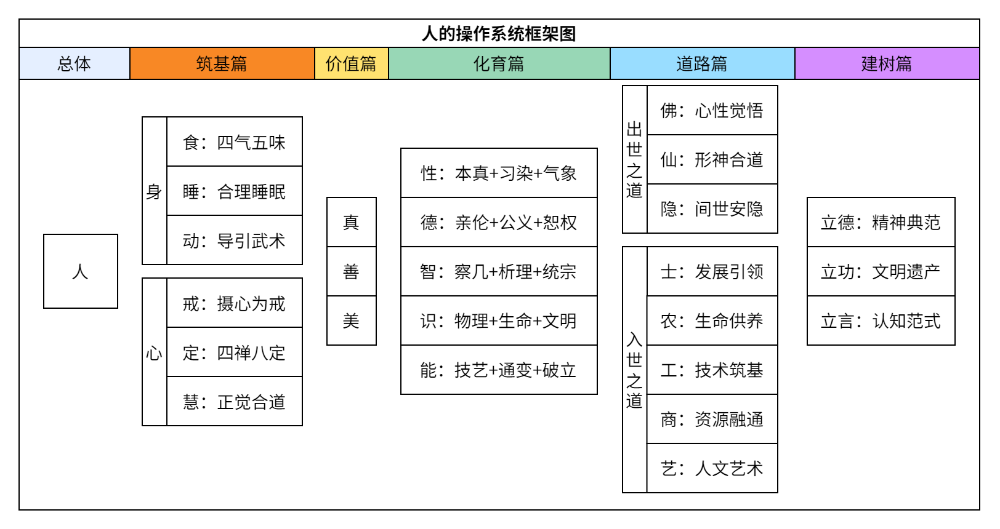

# 前言

<!-- 

人的操作系统

-性命篇
--身
---食：四气五味
---睡：合理睡眠
---动：导引武术
--心
---戒：摄心为戒
---定：四禅八定
---慧：正觉合道

-价值篇
--真：事实层面
--善：伦理层面
--美：范式层面

-化育篇
--性：本真+习染+气象
--德：亲伦+公义+恕权
--智：察几+析理+统宗
--识：物理+生命+文明
--能：技艺+通变+破立

-道路篇
--出世之道
---佛道：心性觉悟
---仙道：形神合道
---隐道：间世安隐

--入世之道
---智识之道：发展引领（士）
---生态之道：生命供养（农）
---创制之道：技术筑基（工）
---通济之道：资源融通（商）
---文艺之道：人文艺术（艺）

-建树篇
--立德：精神典范
--立功：文明遗产
--立言：认知范式

 -->

人的操作系统，旨在探索和构建以人为本的人的框架和人生框架，搭建训练体系，构建最小工具集，既不失系统性和究极性，又兼顾实用性。

　　　　　　　　　　　　┌食：四气五味
　　　　　　　　　　┌身┼睡：合理睡眠
　　　　　　┌性命篇┤　└动：导引武术
　　　　　　│　　　│　┌戒：摄心为戒
　　　　　　│　　　└心┼定：四禅八定
　　　　　　│　　　　　└慧：正觉合道
　　　　　　│　　　┌真：事实层面
　　　　　　├价值篇┼善：伦理层面
　　　　　　│　　　└美：范式层面
　　　　　　│　　　┌性：本真+习染+气象
　　　　　　│　　　├德：亲伦+公义+恕权
　　　　　　├化育篇┼智：察几+析理+统宗
人的操作系统┤　　　├识：物理+生命+文明
　　　　　　│　　　└能：技艺+通变+破立
　　　　　　│　　　　　　　　┌佛道：心性觉悟
　　　　　　│　　　┌出世之道┼仙道：形神合道
　　　　　　│　　　│　　　　└隐道：间世安隐
　　　　　　├道路篇┤　　　　┌智识之道：发展引领（士）
　　　　　　│　　　│　　　　├生态之道：生命供养（农）
　　　　　　│　　　└入世之道┼创制之道：技术筑基（工）
　　　　　　│　　　　　　　　├通济之道：资源融通（商）
　　　　　　│　　　　　　　　└文艺之道：人文艺术（艺）
　　　　　　│　　　┌立德：精神典范
　　　　　　└建树篇┼立功：文明遗产
　　　　　　　　　　└立言：认知范式

